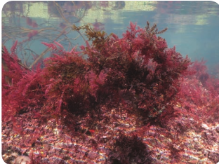
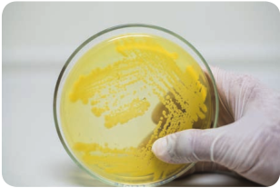
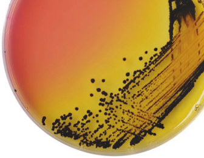
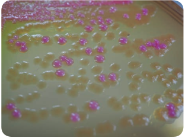
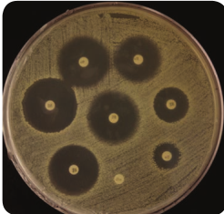
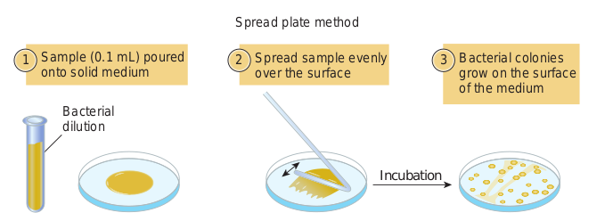
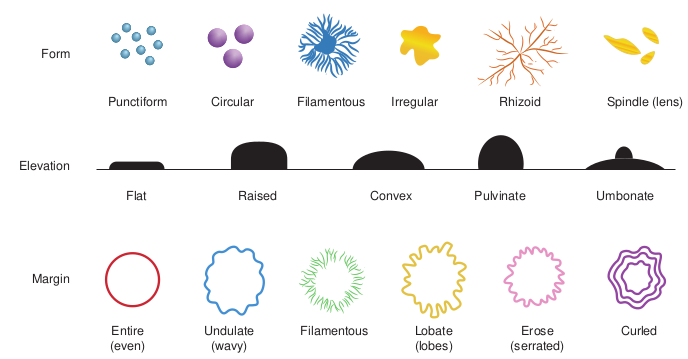
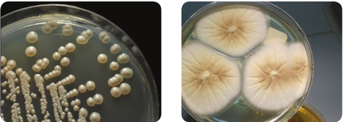

  

**Chapter** 5 **Cultivation of Microorganisms Chapter Outline**

**5.1** Significance of Culturing Microorganisms

**5.2** Bacteriological Media and its Types

**5.3** Pure Culture

**5.4** Growth and Colony Characteristics of Bacteria and Fungi

After studying this chapter the student will be able,

_• To know the importance of bacterial media for growth of microorganisms. To understand various types of media for differentiation and diagnosis of important pathogenic microorganisms._

_• To know pure culture techniques • To understand the methods involved_

_in isolating pure culture of bacteria, which includes pour plate, spread plate and streak plate._

_• To differentiate the growth characteristics of bacteria and fungi._

**Learning Objectives**

bo bac

con ind

Microorganisms are omnipresent and they exist in soil, air, water, spoiled food, decayed animal and plant residues. They are found  

in environment as pathogens and normal microflora. Excellent supporting factors are available in nature for microorganisms to survive in the environment. This leads to microbial proliferation as an extended community in nature. The term ‘cultivation of microorganisms’ means growing microorganisms in the laboratory with ample supply of specific nutrients (Figure 5.1). Obligate intracellular parasites like viruses, _Rickettsias_ and _Chlamydias_ are cultivated within living cells.

Survival and growth of microorganisms depend upon the favourable growth environment. Laboratory cultivation plays a crucial role in the isolation, identification and classification of microorganisms. Cultivation of bacteria and fungi by artificial formulated medium is one of the important milestones in the history of Microbiology.

The microorganisms on the handprint of an eight-year-old y. After incubation the plates showed coloured colonies of teria and fungi as you see above.

The cultivation of microorganisms under laboratory dition makes the microscopic cells to grow and form ividual colonies macroscopically.

  

Robert Koch devised the solid medium (by using gelatin) to grow and isolate the microorganisms.

## Significance of Culturing Microorganisms

• To isolate microorganisms from any samples

• To study the morphology and biochemical characteristics of microorganisms

• To maintain the stock culture • To identify disease causing

microorganisms • To study the role of microorganisms

in the production of industrially important products

## Bacteriological Media and its Types

Generally microorganisms occur as mixed culture in nature. Human beings, animal bodies and other natural resources harbour microbes in mixed population. By using appropriate media, microorganisms can be grown separately in pure form and can be studied. For successful cultivation of a given microorganism, it is necessary to

**Flowchart 5.1:**

\* Liquid \* Semi-solid \* Solid

\* Synthetic \* Non-synth

**Types of**

Physical Chemica  

understand the nutritional requirements of that microorganism and then supply the essential nutrients in proper form and proportions in culture medium. Flowchart 5.1 describes the types of media. A common bacteriological medium has Carbon and Nitrogen sources along with buffering agents. Most of the media are prepared using dehydrated components. The basic components are peptone, beef extract, meat extract, yeast extract and agar (Table 5.1).

**Table 5.1:** Common ingredients of a culture media

**S.No Ingredients Source of**

a. Peptone (protein hydrolysates)

Carbon, nitrogen, energy

b. Beef extract (Extract of lean beef)

Aminoacids, vitamins, minerals

c. Yeast extract (Brewer’s yeast)

Vitamin B, Carbon, Nitrogen

d. Agar Solidifying agent

Types of media

etic

**Media**

l Special purpose

\* Basal \* Enriched \* Selective \* Differential

\* Anaerobic \* Transport \* Antibiotic

sensitive

| S.N o |Ing re d i ent s |S ou rc e  o f |
|------|------|------|
| a. |Peptone(p roteinhydr olys ates) |C arb on,ni t rog en,en er g y |
| b. |B e ef ext rac t(E xt rac t o fle an b e ef ) |Amin o acid s,v it amin s,min era ls |
| c. |Ye ast ext rac t( Br e we r’sye ast ) |Vit amin B ,C arb on,Nit rog en |
| d. |Ag ar |S olidif y in gage nt |

| al  Chemica |Special p |
|------|------|------|
| l |
  

**Uses of agar:** • It is one of the principle ingredients in the

preparation of solid or semisolid media.

• It is used as a solidifying agent in culture medium.

• It is extracted from certain seaweeds belonging to genera of red algae like _Gelidium_ and _Gracilaria_ (Figure 5.1).

• It is a sulphated polymer mainly consisting of D-galactose.

• Agar is a highly preferred solidifying agent because it does not affect the growth of microorganisms. Agar is also used in the food and pharmaceutical industries.

• The purified form of the agar is called Agarose. It is prepared by removing the

**Table 5.2:** Concentration of agar in media

**Nature of Medium Concentration E Solid** 2% Nutrie

**Semisolid** 0.5% SIM (S Motilit

**Liquid** 0% Nutrie  

pectin from the Agar. It is used in Molecular Biology laboratory for the separation of DNA molecules by gel electrophoresis.

Agar was first described for use in Microbiology in 1882 by the German microbiologist Walther

Hesse, an assistant working in Rober Koch’s laboratory, as suggested by his wife Fannie Hesse.

A cheap substitute for agar in microbial culture media is Guar gum, which can be used for the isolation and maintenance of thermophiles.

Why is agar preferred to gelatin as a solidifying agent in culture media?

**HOTS**

### Physical Nature of Agar Medium

The concentration of agar plays a major role in determining the consistency of the medium. A medium with agar concentration of 2% or greater is said to be a solid medium and that of 0.5% is said to be a semisolid medium (jelly like appearance). Tabel 5.2 lists the concentration of agar in

**xample Uses** nt agar To isolate microorganisms

on petridish and forming agar slant

ulphur Indole y medium)

Agar stab to observe motility

nt broth To observe biochemical reaction.

| Nature of Medium |C oncentration |Example |Uses |
|------|------|------|------|
| S ol i d |2% |Nut r ien t a ga r |To i s ol ate micr o orga ni sm son p et r idi sh a nd f or min gag ar  s l ant |
| S emis o li d |0.5% |SIM ( Su lphur  Indo leMot i li t y m e di um) |Aga r s t ab t o o bs er vemotil it y |
| L iq u id |0% |Nut r ien t b rot h |To o bs er ve b io chemic a lre ac t io n. |
  

media. However liquid media (broth) does not contain agar. Figure 5.2 shows types of media depending on physical nature.

### Chemical Nature of Medium

**• Synthetic medium** Chemically defined synthetic Medium is used for various experiments. This medium is prepared exclusively from pure substances with known chemical composition and concentrations. This is widely used in research to find the type of compound metabolized by the experimental organism.

**• Non-synthetic medium** The medium in which the exact chemical composition and the concentration of each ingredient is not certainly known is called non-synthetic medium. In this medium, crude materials such as meat extract, yeast extract, various sugars, molasses and corn steep broth are used. This supports the growth of a variety of microorganisms. It is otherwise called as complex medium.

Veggitone is a vegetable based product containing peptones. It is made from raw materials such as peas and fungal proteins that are digested using fungal and bacterial enzymes.

**Infobits**

### Special Purpose Medium

**i) Basal medium** This medium promotes the growth of many types of microorganisms which do not require any special nutrient supplement. It is a routine laboratory medium with Carbon and Nitrogen sources along with some minerals. Example: Nutrient Agar or Nutrient Broth. It is also called general purpose medium. It is used for subculturing the pathogens. It is a non- selective medium, which is designed to support the growth of a wide spectrum of heterotrophic organisms. (Figure 5.3)

**ii) Enriched medium** In enriched medium, substances like blood, egg or serum are added along with the basal medium. It is used to grow fastidious organisms that are very particular in their nutritional needs. Fastidious organisms

  

have elaborate requirements of specific nutrients like vitamins and growth promoting subtances and or not easily pleased or satisfied by ordinary nutrients available in nature. Example: Blood agar is used to identify haemolytic bacteria (Figure 5.4) and Chocolate agar used to identify _Neisseria gonorrhoeae._

In 1919, James Brown used blood agar as diagnostic medium to study the haemolytic patterns of bacteria.

**iii) Selective medium** Selective medium contains one or more agents (selective components) that inhibit unwanted organisms but allow the desired organisms to grow. Growth of unwanted microbes is suppressed by adding bile salts, antibiotics and dyes. Example: Mannitol salt agar is selective for _Staphylococci._ This medium contains  

7% Sodium chloride that inhibits the growth of other bacterial population but allows the growth of _Staphylococci_ (Figure 5.5). Moreover it has Phenol red dye to indicate acid production. _Staphylococcus_ utilizes Mannitol and produces acid which changes the colour of the Phenol red indicator to yellow. Salmonella-Shigella (SS) agar is selective for _Salmonella_ (Figure 5.6).

  

It is nothing short of amazing and humbling fact that even after 120 years of trying to

grow microbes in the laboratory, we have succeeded in culturing only 0.1% of the microorganisms around us.

**iv) Differential medium** Differential medium distinguishes between different groups of bacteria and permit tentative identification of microorganisms based on their biological charaterstictics as they cause a visible change in the medium. We can differentiate haemolytic and non-haemolytic patterns of bacteria using blood agar. Differential medium is otherwise called indicator medium as it distinguishes one organism from another growing on the same plate by the formation of pigments due to its biochemical and physiological nature. Example: MacConkey agar medium has neutral red dye. Lactose fermentors form pink coloured colonies and non fermentors form colourless translucent colonies on it (Figure 5.7).

bacterial colonies appears pink)  

Eosin Methylene Blue (EMB) agar medium is also a differential medium. It is used to differentiate lactose fermentors from non-lactose fermentors. It has lactose sugar and two dyes namely Eosin –Y and Methylene blue. These dyes act as inhibitory agent towards Gram positive bacteria. Example: Lactose fermentors such as faecal _Escherichia coli_ show metallic sheen and non lactose fermentors such as _Enterococcus_ do not show metallic sheen. (Figure 5.8).

Acidic pH (pH drops below 6.8)

Lactose fermentation

Makes Eosin-Y and Methylene blue to form a complex

Inhibits Gram positive bacteria

**Colonies of lactose fermentors has metallic sheen**

  

Why is EMB medium called a selective, differential as well as complex medium?

**HOTS**

**v) Enrichment medium** Enrichment medium is a liquid medium. It is used to grow a particular microorganism that is present in much smaller number along with others present in sufficiently large numbers. An enrichment medium provides nutrients and environmental conditions that favour the growth of a desired microorganisms. It is used to culture microorganisms present in soil or faecal samples that are very small in number. Example: Selenite F Broth is used to isolate _Salmonella typhi_ present in low density in faecal sample. It is cultured in an enrichment medium containing Selenium. Selenium supports the growth of the desired organism and increase it to detectable levels compared to intestinal flora. Sodium selenite inhibits many species of Gram positive and Gram negative bacteria including _Enterococci_ and coliforms.

**C h r o m o g e n i c medium** is used for the simple and fast detection

of transformed bacteria by using chromogenic substrates. The chromogenic mixture contains substrates such as Salmon-GAL, X-GAL. Certain bacterial enzymes cleave the chromogenic substrate resulting in the coloured colonies.  

**vi) Antibiotic sensitivity medium** Antibiotic sensitivity medium is a microbiological growth medium that is commonly used for antibiotic sensitivity testing. Example: Muller- Hinton agar medium. It is a non-selective and non- differential medium. It allows the growth of most type of microorganisms. It contains starch which absorbs toxins released from bacteria. Hence toxins do not interfere with antibiotics. Agar concentration of 1.7% is used in this media which allows better diffusion of antibiotics (Figure 5.9).

**vii) Anaerobic medium** Anaerobic medium is a medium used for the cultivation of anaerobes, Example: i) Robertson cooked meat medium: This is used for the isolation of _Clostridium_ ii) Thioglycolate broth: In this medium Sodium thioglycollate is used as a reducing agent which maintain a low Oxygen tension by removing the molecular Oxygen from the environment.

**viii) Transport medium** Transport medium is used for the temporary storage of specimens that are being transported to the laboratory for cultivation. It maintains the viability of all

  

organisms in the specimen without altering their concentration. It mainly contains buffers and salts. Example: Stuart’s transport medium that lacks Carbon, Nitrogen and organic growth factors. Other examples of transport media are Cary Blair and Amies.

**Viral Transport Medium** is used to carry a specimen containing viruses. Universal Transport Viral Medium (UTVM). This liquid medium is stable at room temperature. It is used for collection, transport, and maintenance and long term freeze storage of viruses.

**Infobits**

**Exceptions in cultivation of microbes in artifical medium**

Some bacteria like _Mycobacterium leprae_ and _Treponema pallidum_ cannot be cultivated in artificial medium.

**ix) Media used for isolation of fungi** Apart from the bacteriological media, fungal media are used to study fungal morphology pigmentation and sporulation. Sabouraud’s Dextrose Agar (SDA) is used as a common medium to isolate fungus. There are several other important fungal media used for fungal cultivation. Examples Niger Seed Agar and Potato Dextrose Agar

1\. Which medium is used to carry the sample when the sick person is unable to come to the laboratory?

2\. Give a special medium to check the growth of anerobes in a burn wound infection with dead tissues.

**HOTS**  

## Pure Culture

In nature, microorganisms usually exist as complex multispecies community. A single species has to be characterized in order to know the morphology, pathogenicity and molecular genomic pattern of the organism. For characterizing a species we have to isolate the organisms in pure form. Pure culture or axenic culture is a culture containing only one type of organism. The descendents of a single organism in pure culture is called a strain. A strain forms a single colony. Colony is a cluster of microorganisms in which all the characters of the family remain same. With the advent of the pure culture techniques many microorganisms are being identified.

### Methods Employed in the Isolation of Microorganisms

Though there are many methods designed for isolation of microorganisms, pour plate method, spread plate method and streak plate method are widely used in the field of Microbiology.

**i) Pour plate method**

• It is the used for the isolation and counting of colony forming bacteria in the specified sample.

• In this technique a sample is diluted several times to reduce the density of the microbial population.

• A very small amount of diluted sample (1ml or 0.1ml) is mixed with the molten agar at a temperature of 45°C.

• The mixture is poured into the sterile petridish (In 1887, Juluis Richard Petri, a worker in Koch’s laboratory, designed the Petriplate.) in an aseptic condition

  

and plates are incubated at a specific temperature for a given period of time.

• Plates are incubated in an inverted manner.

• After incubation, the colonies are formed in a discrete pattern both on the surface of agar and also embedded within the medium.

• Pour plate can be also used to deter- mine the number of cells in a popula- tion.(Figure 5.10)

**Disadvantages of pour plate method** i) Loss of viability of heat sensitive

organisms coming into contact with hot agar.

Nowadays media are available as contact p slide and settle plates which are used for m gas lines in food and beverage production enumeration of typical food contaminants s

Colour coded MC-MEDIA pads are ava testing for _Escherichia coli_, yeast, mold, coli

**Infob**

Bac Susp

Molten agar

at 45ºC-50ºC

M

ii) Reduced growth of obligate aerobes in the depth of agar.

iii) Colonies embedded within the agar are much smaller than that of surface and may be confluent or invisible.

Basic five ‘**I**’ steps one should follow in culturing micro organisms

a. **I**noculation b. **I**ncubation c. **I**solation d. **I**nspection e. **I**dentification

lates, agar strips, media cassettes, contact icrobial air monitoring and compressed

plants. These media are also used for the uch as coliforms, yeast and molds. ilable for rapid and convenient microbial form and aerobes.

**its**

terial ension

ix, Incubate

Colonies grow on surface and within agar

r plate method

  

**ii) Spread plate method**

• Spread plate method is an easy and direct method of isolating a pure culture.

• In this technique a specified amount of diluted inoculum (0.1ml or less) of microbial culture is seeded on agar plate.

• After inoculation of the sample on the agar medium, the inoculum is evenly spread on the surface with the help of a sterile glass L rod (a bent glass rod)

• Microorganisms are evenly distributed in the entire surface of agar.

• The dispersed microorganisms develop into isolated colonies.

• In this method, the plates are incubated at a specified temperature for a given period of time.

• After incubation the plates are observed for the growth of discrete colonies.

• The number of colonies are equal to the number of viable organism. This method can be used to count the microbial population (Figure 5.11).

Bacterial dilution

Sample (0.1 mL) poured onto solid medium

Spread over the

1 2

Spread plat

**iii) Streak plate technique**

• The streak plate technique is one of the most commonly used methods for isolating pure culture of bacteria.

• In this method, a loopful of inoculum from a sample is taken and it is streaked across the surface of the sterile solid medium.

• Different streaking patterns can be used to separate individual bacterial cell on the agar surface.

• After the first sector is streaked the inoculated loop is sterilized and inoculum for the second sector is obtained from the first sector.

• Similar process is followed for streaking the further areas in the sectors.

• Since the inoculum is serially diluted during streaking patterns the dilution gradient is established across the surface of the medium.

• After streaking, plates are incubated at a specific temperature for a given period of time.

sample evenly surface

Bacterial colonies grow on the surface of the medium

3

e method

Incubation

ad plate method

  

• After incubation, plates are observed for growth of colonies (based on the streaking pattern and density of culture growth of microbes are abundant in the first sector in comparison with the formation of separated discrete colonies in the fourth sector of the agar medium).

• Each isolated colony is assumed to be grown from a single bacteria and thus represent a clone of pure culture.

• Successful isolation depends on spatial separation of single cells (Figure 5.12).

**Micro manipulator:** It is a device used along with a microscope to pick a single bacterial cell from a mixed culture.

It has micropipette or microprobe so that a single cell can be picked up.

**Infobits**

Second set of streaks

**A B**

**D**

Initial inoculum

Fourth set of streaks

Third set of streaks

## Growth and Colony Characteristics of Bacteria and Fungi

In the previous section we have learned the various types of media and specific purpose of each medium. Morphology is the basic criteria for the isolation, identification and classification of microorganisms. Colony characteristics are the basic tool in the field of taxonomy.

Bacteria grow in both solid and liquid medium, but identification will be easy on the solid medium. In solid medium bacteria form colonies. In liquid medium growth of bacteria are generally not distinctive because there is uniform turbidity or sediment at the bottom or pellicle is formed on the surface.

Some basic attributes such as shape, size, colour, pigmentation, texture, elevation and margin of the bacterial colony in the growth medium are explained below.

Heavy confluent growth

Heavy growth

Light growth

Discrete colonies

**C**

**E**

1

2 3

4

Incubation

k plate isolation method

  

### Colony Morphology of Bacteria on Solid Media

**Shape:** The shape of colony may be circular, irregular, filamentous, rhizoid. **Elevation:** It is the side view of the colony. It may be flat, raised, umbonate (having a knobby protuberance) crateriform, convex pulvinate (cushion shaped) **Margin:** The margin of the bacterial colony may be entire (smooth) irregular, undulate (ovary), lobate, curled, filiform. The irregular shape of the colony give irregular margin (Figure 5.13). **Colony Size:** The diameter of the colony is measured in millimeter. It is described in relative terms such as pinpoint, small, medium and large. **Appearance of colony on the surface:** The bacterial colonies are frequently shiny/ smooth in appearance. Colonies may be veined, rough, dull, wrinkled, or glistening. **Texture of the colony:** Texture means consistency of the bacterial growth. It may

FilamentouCircularPunctiform

Form

Elevation

Margin

Flat Raised

Entire (even)

Undulate (wavy)

Filamento

be dry, moist, mucoid, brittle (dry breaks apart), viscid (sticks to loop, hard to get off), viscous, or butyrous (buttery). **Opacity of the bacterial Colony:** Colonies may exhibit different optical density. It may be transparent (clear), opaque (not clear), translucent (almost clear), or iridescent (changing colour in reflected light). **Colony Odour:** Some bacteria produce a characteristic smell, which sometimes helps in identifying the bacteria. Actinomycetes produce an earthy odour which is quite often experienced after rain. Many fungi produce fruity smell while _Escherichia coli_ produce a faecal odour.

Smooth colonies of _Streptococcus pneumoniae_ are usually virulent, where

as rough colonies are non-virulent. But in _Mycobacterium tuberculosis_ colonies with rough surface indicates a good factor of virulence.

s Irregular Rhizoid Spindle (lens)

Convex Pulvinate Umbonate

Lobate (lobes)

Erose (serrated)

Curledus

orphology of bacteria

  

**Colony Colour:** Many bacteria develop colonies which are pigmented.(Table 5.3) Some bacteria produce and retain water insoluble pigments and the colonies appear coloured by taking the pigment intracellularly (Figure 5.14). But some bacteria produce water soluble pigment which diffuse into the surrounding agar. Example: Pyocyanin pigment of _Pseudomonas aeruginosa_ is a water soluble pigment and give blue colour to the medium.

Certain water soluble pigments are fluorescent in nature Example: Py- overdin. Agar medium

around the colonies glows white or blue green when exposed to ultraviolet light.

### Nature of bacterial growth in liquid medium
 1\. If the entire broth appears milky and

cloudy it is called turbid. 2. If deposit of cells are present at the bottom

of the tube, the term sediment is used. 3. If the bacterial growth forms a

continous or interrupted sheet over the broth it is called pellicle (Figure 5.15).

### Growth and Colony Characteristics of Fungi

Fungi are eukaryotic organisms. They exist in both unicellular-yeast like form and in filamentous multicellular hyphae or mold form and some are dimorphic. Generally

owth in Liquid medium

  

fungi prefer to grow in the acidic medium. Sabourad Dextrose Agar (SDA) plates and Potato Agar plates are used for general cultivation of fungi. The acidic nature of SDA agar reduce the growth of bacteria.

The characters to be noticed in colony of fungi are colour of the surface and reverse of the colony, texture of the surface (powdery, granular, ecolly, cottony, velvety or glabrous), the topography (elevation, folding, margin) and the rate of growth.

Dimorphic fungi are fungi that can exist in both mold and yeast form depending on environmental and physiological conditions. Example: _Histoplasma capsulatum,_ a human pathogen, grows as a mold form at room temperature and as a yeast form at human body temperature.

**Infobits**

**Table 5.3:** Pigmentation of chromogenic ba

Bacteria _Serratia marcescens Staphylococcus aureus Micrococcus luteus Pseudomonas aeruginosa_

**• Growth and colony characteristics of yeast _Candida_** Yeasts are grown on Sabourad Dextrose Agar aerobically. Yeasts grow as typical pasty colonies and give out yeasty odour. The colony morphology varies with different yeasts. Yeasts colonies generally have smooth texture and are larger than bacterial colonies on SDA medium (Figure 5.16a).

**• Growth and Colony characteristics of mold _Mucor_** The genus _Mucor_ is typically coloured white to brown or grey and is fast growing. Older colonies become grey to brown due to the development of spores. (Figure 5.16b).

cteria

Pigment colour Red Golden yellow Yellow _Green_

d Dextrose Agar media a) yeast growth

| B ac ter i a |Pig men t co lo ur |
|------|------|
| S er ratia m arces cens |Re d |
| Staphyloc oc c u s  a ure u s |G olden y el lo w |
| Micr ococcu s l uteu s |Yel l ow |
| Pseudomonas aeruginosa |Gree n |

  

**ICT CORNER**

**Step2Step1**

**Streak Plat**

**URL:** http://learn.chm.msu.edu/vibl/content/ streakplate.html

**Isolation of pure culture of bacteria**

**STEPS:** • Use the URL or scan the QR

Bacteriology Laboratory. • Click module and read the des • Do the streak plating process

left order. • Heat and cool the loop betwee  

**Step3**

**Step4**

**e Technique**

code to reach ‘Virtual Interactive

cription and steps. from the top left part to the bottom

n each steps.

  

**Summary**

In natural environments microogran- isms exist as mixed cultures. Survival and growth of microorganisms depends upon the availability of favourable growth envi- ronment. Cultivation of microorganisms in the laboratory plays an important role in isolation, identification and classifica- tion of microorganisms. A medium is an environment which supplies the nutrients necessary for the growth of the micro- organisms. Various kinds of media have been prepared to satisfy the need of the microorganism to be isolated as a pure culture. Based on the physical, chemical and special purposes, media are classified and are used to identify a particular or- ganism from a clinical specimen or envi- ronment. In Microbiology there are many methods used for isolation of microor- ganisms. The methods commonly used for isolation are pour plate, spread plate method and streak plate method.

The growth of organisms on media is a basic criteria in the isolation, identification, and classification of microorganisms. Colony characterization of both bacteria and fungi highly depends upon the nutrients, temperature and pH.

**Evaluation**

**Multiple choice questions**

1\. In a culture, the desired organism is low in number when compared with unwanted microorganism. Which media can be used to isolate the desired organism? a. Selective media b. Enriched media  

c. Basal media d. General purpose media

2\. is an example for differential media a. Blood agar b. EMB agar c. Both a and b d. None

3\. A medium in which precise ingredients are clearly defined. a. Synthetic medium. b. Non synthetic medium. c. Complex medium d. Natural medium

4\. A microbial inoculum of faecal specimen is subjected to isolation of typhoid bacilli species. Which medium can be used to select the bacilli? a. Selective medium b. Basal medium c. Enriched medium d. Differential medium

5\. is the method in which inoculum is not placed over the surface of agar plate. a. Pour plate method b. Spread plate method c. Streak plate method d. All the above

6\. Name the method in which the inoculums is mixed with the molten agar medium in the test tube and poured into the sterile petridish a. Pour plate method b. Spread plate method c. Streak plate d. All the above

  

7\. The culture with only one type of organism in the colony is called

a. Pure culture b. Mixed culture c. Semi mixed culture d. Contaminated culture

8\. Identify the reason for the meager growth of aerobic colonies in pour plate isolation method a. Less oxygen availability b. More oxygen availability c. Carbon-di-oxide availability d. None of the above

9\. If a microbial inoculum is with more contaminations, which method will be used for isolation? a. Spread plate method b. Pour plate method c. Streak plate method d. All the above

10\. The plate has a culture of A and B with definite circular morphology If A is producing an inhibitory substance towards B, what will happen to the colony morphology of B? a. Change in the colony pattern of A b. Change in the colony pattern of a B c. Change in the colony pattern of

both A and B d. No change

11\. If a plate observing for colony morphology is subjected to contamination, what will happen to the colony?  

a. Growth will be clear b. Growth will not be clear c. Growth will be either clear or

disturbed. d. None of the above

12\. If chromogenic bacteria produce intracellular water insoluble pigment, it will stain a. Growth of a colony b. Agar medium c. Both a and b d. None of the above

13\. If the water soluble pigment of the pigmented bacteria diffuses into the medium, a. Medium gets pigmented b. Colony get stained c. Both a and b d. None of the above

**Answer the following**

1\. Define semisolid media with an example.

2\. State basal media with an example.

3\. What is synthetic medium? Give suitable example.

4\. State a few aspects of enrichment medium.

5\. State 3 fungal media used for isolation of fungi.

6\. Define pure culture.

7\. How do you differentiate pure culture from mixed culture?

  

8\. Why are the colonies growth on surface in pour plate method are quite larger than those within the medium?

9\. Why is it important to invert the petridish during incubation?

10\. State the various forms in the appea- rance of the colony. Name the pigments produced by _Pseudomonas aeroginosa._

11\. Colony characteristics will be studied and identified clearly by using the nutrient agar medium in agar rather than agar slant. Why?

12\. Write about the elevation of the bacterial colony?

13\. Explain streak plate/pour plate/spread plate method.

14\. Why is agar mainly used as a solidifying agent even though other solidifying agents are available?

15\. How do you differentiate enrichment medium from selective medium?  

16\. Give a list of pigment producing bacteria.

17\. Explain the opacity of a bacterial colony.

18\. Explain the special purpose media in detail (any 5).

19\. Why should we use a streak plate to grow a bacterium rather than on agar medium slant or in broth medium?

20\. Expain the colony morphology of bacteria with diagrams.

**Student Activity**

1\. The student will list out the substances which contain agar in their routine life and the role of agar in it.

2\. Students will prepare chart/scrap book containing pictures of different types of media and colony types of bacteria and fungi.

3\. Collect decayed/spoilt food for macroscopic observation.

