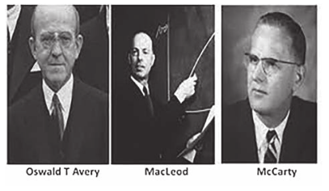
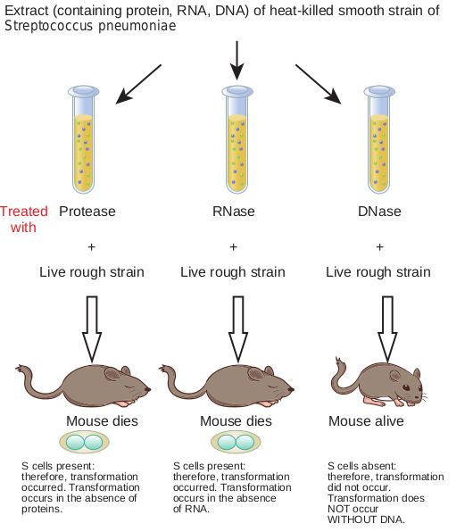
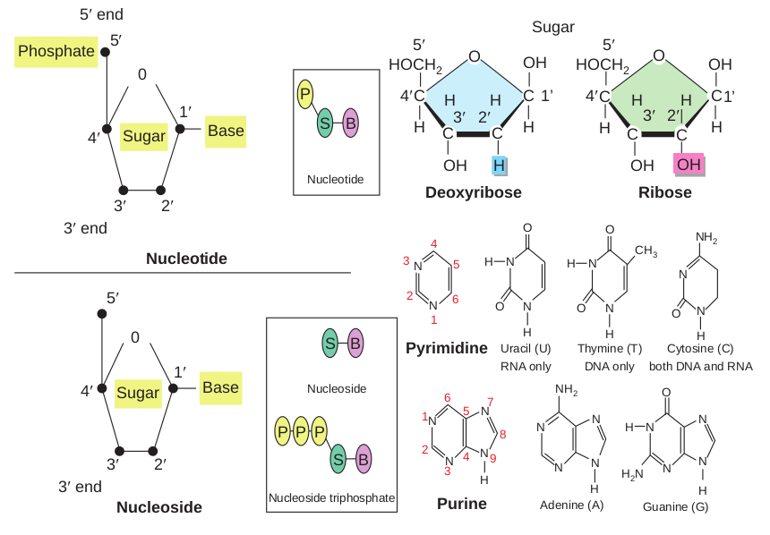
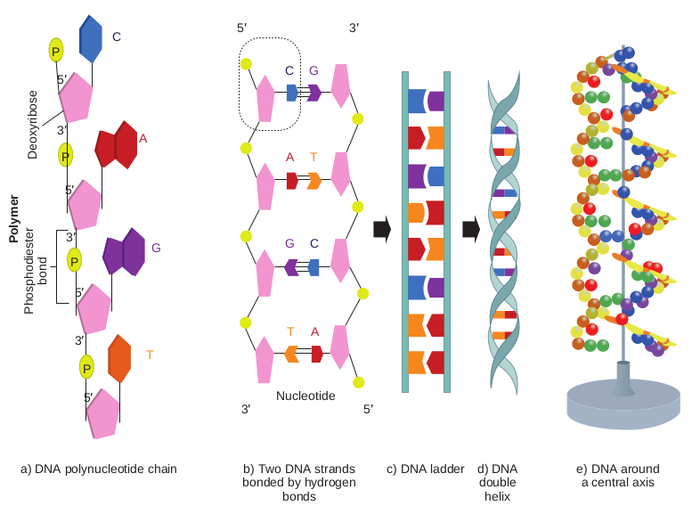
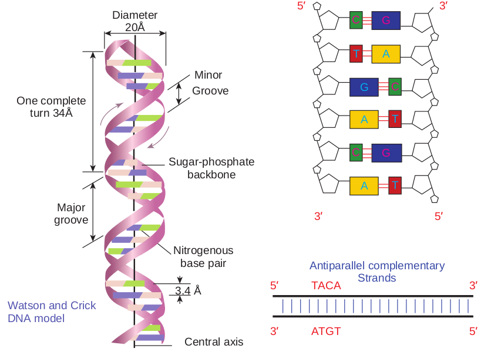
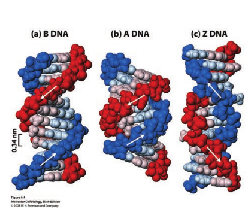
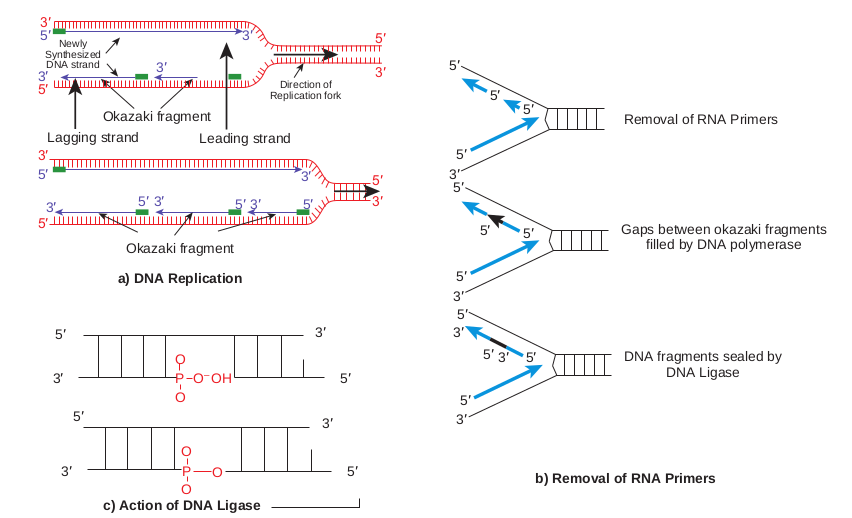

  

**Chapter** 14 **Microbial Genetics Chapter Outline**

**14.1** Genetic Information is Stored in DNA

**14.2** Structure of DNA

**14.3** DNA Replication

After studying this chapter the student will be able,

• To _review the historical discoveries that led to establishing DNA as the genetic material._

_• To identify the role of genetic material._

_• To recognize the contributions of Griffith, Avery, MacLeod, and McCarty, and Hershey and Chase._

_• To explain the structure of DNA. • To recognize the contributions_

_of Chargaff, Rosalind Franklin, Maurice Wilkins, Watson and Crick._

_• To describe the Watson and Crick model of DNA._

_• To compare structure of DNA and RNA._

**Learning Objectives**

de pa stu the DN pro be  

Microbial genetics provides powerful tools for ciphering the regulation, as well as the functional and thway organization of cellular processes. The genetic dy of microbes has played a highly significant role in developments of Molecular Biology, Recombinant A Technology and in the preparation of useful ducts. Microbial Genetics makes microbes beautiful,

neficial and bountiful.

## Genetic Information is Stored in DNA

Microorganisms are diverse in nature. A particular bacterium can be identified based on certain characteristics. When a bacterial cell grows and divides, it gives rise to cells with similar characteristics. Have you ever pondered as to why some of the characteristics of progeny cells are similar and a few dissimilar?

In the middle of the 19th century it was assumed that there was some particle present somewhere in the cell which

_• To know Meselson and Stahl’s experiment._

_• To explain the steps of replication. • To know the enzymes and their roles_

_involved in DNA replication._

|------|
| M icr o b i a l g en et ics p r o v ides p o w er f u l t o o l s f o rde ci p h er in g t h e r egu l at io n, a s w e l l a s t h e f un c t io n a l a n dp at hwa y o r ga niza t io n o f ce l l u l a r p r o ces s es. Th e g en et ics t ud y o f micr o b es h a s p l ay e d a hig h l y sig nif ic a nt r o le int h e de v e lo p m en ts o f M o le c u l a r B io log y, R e co m b in a ntD NA T e c hn o log y a n d in t h e p r ep a ra t io n o f u s ef u lp r o d uc ts.  M icr o b i a l G en et ics m a k es micr o b es b e au t if u l ,b en ef ici a l a n d b o un t if u l . |
  

was the controlling factor to carry the characteristics from one generation to another.

Genetics, a branch of science aims to understand the working of the controlling factor. The factor governing the transfer of information is now very well known as Gene. Gene can be defined as a unit of heredity which is transferred from parent to progeny.

Although there were experiments to prove the inheritance pattern due to gene, there was no real understanding of the molecular nature of the gene. Work of Frederick Griffith introduced the transforming principle which was further confirmed as Deoxyribonucleic acid (DNA) by experiments of Avery, Mac Leod and Mac Carty in 1944 followed by Hershey and Chase in 1952.

### Frederick Griffith’s Experiment

In 1928, British b a c t e r i o l o g i s t Frederick Griffith (Figure 14.1) was trying to develop a vaccine against pneumonia. In his experiments Griffith used two related strains of _Streptococcus pneumoniae_ (Figure 14.2)_._

1\. Rough strain (R) – avirulent, non-capsulated strain, forming rough colonies on culture media.

2\. Smooth strain (S) – virulent, capsulated strain (resists phagocytosis), forming smooth colonies on culture media.

Griffith injected live smooth strain into mice which caused disease and killed it. When he injected live rough strain into mice, it did not cause disease and mice remained alive. He heat killed the smooth strain and injected into mice, the mice remained alive. But the experiment gave surprising results when a mixture of harmless live rough strain and heat- killed smooth strain was injected into mice. Griffith observed that the mice developed pneumonia and died. Further, when he analysed the blood sample from dead mouse, he found that it contained live smooth strain. This accidental discovery made Griffith to conclude that the rough strain changed (transformed) into smooth strain by taking up a substance which he called a “transforming principle” from heat killed smooth bacteria. This phenomenon is called “Bacterial Transformation” Griffith’s experiment is summarized in Figure 14.3.

lonies of _Streptococcus pneumoniae_

  

What did Griffith expect to happen to mouse when he injected it with live rough strain and heat killed smooth strain

**HOTS**

### Oswald T. Avery, Colin Mac Leod and Maclyn Mc Carty’s Experiment

Griffith’s experimental results led to the curiosity to explore the transforming principle. Avery and his colleagues

Mouse dies Mouse heMouse healthy

Live rough strain

Live smooth strain

Heat-killed smooth strain

H

(Figure 14.4) used the extracts of heat-killed smooth bacteria and treated it with enzyme protease, RNase, DNase to eliminate proteins, RNA and DNA respectively. Each of the treated extracts were mixed with live rough bacteria and injected into mice. The mice injected with a mixture of DNase treated extract and live rough strain did not die. This partially proved that DNA was responsible for changing the rough strain of _Streptococcus pneumoniae_ bacteria into smooth bacteria. Avery _et al.,_ experiment is summarized in Figure 14.5. Later Hershey and Chase’s experiment on T2 bacteriophage confirmed that genetic information is present in DNA.

These important early experiments and many other lines of evidence have shown that DNA bears the genetic information of living cells and it is responsible for transfer of characteristics from one generation to another. This is true in all organisms, the notable exceptions being RNA viruses

Mouse dies

In blood sample, living S cells are found that can reproduce, yielding more S cells

althy

eat killed smooth strain and live rough strain

f Griffith’s experiment

  

Protease

Live rough strain

Extract (containing protein, RNA, D _Streptococcus pneumoniae_

Live rou

Mouse dies

S cells present: therefore, transformation occurred. Transformation occurs in the absence of proteins.

S cells pres therefore, t occurred. T occurs in th of RNA.

Mou

Treated with

+

RN

**Infob**  

NA) of heat-killed smooth strain of

gh strain

ent: ransformation ransformation e absence

S cells absent: therefore, transformation did not occur. Transformation does NOT occur WITHOUT DNA.

se dies Mouse alive

Live rough strain

\+ +

ase DNase

and Mac Carty’s experiment

**its**

  

which store genetic information in RNA. The understanding of DNA’s role in heredity has led to variety of practical applications including forensic analysis, paternity testing and genetic screening.

## DNA Structure

• DNA is a polymer of simple monomeric units, the nucleotides (Figure 14.6).

• Each nucleotide is made up of three components: 1. Nitrogenous base 2. Sugar 3. Phosphate group

• Nucleotide without phosphate group is known as nucleoside.

The entire genetic cont the study of genomes is g prokaryotes, DNA forms a chromatin, the substance of

may contain tens of thousands of genes. Ma protein product. DNA controls all of the ce or “off.”

**Types of Nu**

DNA

ssDNA Example:

ØX174 phage dsR Exam Rheo

dsDNA Example: _E.coli_

Lamda (λ) phage  

• The sugar present in DNA is deoxyribose sugar.

• The nitrogenous bases present in DNA are \* Purines – Adenine (A), Guanine (G) \* Pyrimidines – Thymine(T),

Cytosine (C) • The nucleotide as a unit is formed by

\* Glycosidic bond between nitrogenous base and sugar,

\* Ester bond between phosphate group and sugar

• Each of the nucleotides is bonded by a phosphodiester bond to form a polynucleotide chain (strand) (Figure 14.7a).

ent of a cell is known as its genome and enomics. In eukaryotic cells, but not in complex with histone proteins to form eukaryotic chromosomes. A chromosome ny genes contain the information to make llular activities by turning the genes “on”

**cleic acids**

Genetic RNA

NA ple:

virus

ssRNA Example:

TMV

Non-genetic RNA:

mRNA, rRNA, tRNA

RNA

  

1′

1′

5′

5′

5′ end

3′ end

3′ end

4′

4′

2′3′

2′3′

0

0

**Nucleotide**

Sugar

Phosphate

Base

Sugar Base

**Nucleoside**

Nucleotide

Nucleoside triphosphat

Nucleoside

BS

BS

BS

P

PPP

• Two polynucleotide chains join together through hydrogen bonds between nitrogenous bases, to form double stranded DNA (Figure 14.7b).

• Two hydrogen bonds exists between adenine and thymine and three hydrogen bonds between guanine and cytosine.

• DNA is coiled in the form of a double helix, in which both the strands of DNA coil around an axis (Figure 14.7d & e).

• The further coiling of this axis upon itself produces DNA supercoiling an important property of DNA structure.

All DNA, whether large or small, possess the same sugar phosphate backbone. What distinguishes one DNA from another is the length of the polymer and distribution of four bases along the backbone. The  

**Deoxyribose**

HOCH2 HOCH2OH OHO O

C C C C

H H

OH OH OH

3′ 3′2′ 2′ 4′

5′ 5′

HH H

H H H

C 4′CC 1’ C1’

N NH

O

O N

H **Pyrimidine** Uracil (U)

RNA only

**Purine** Adenine (A) Guanine (G)

N N

N N N

N NH

O

N

N

N

H H2N

N

NH2

H H

N

Thymine (T) DNA only

Cytosine (C) both DNA and RNA

N

3

2

4 5

6

1

1

2

3 4

5 6 7

8

9

e

Sugar

**Ribose**

N CH3

NH2

H

O

O ON N

N

H H

H

e, deoxyribose, ribose and nitrogenous bases

variety of sequences that can be made from the four nitrogenous bases is limitless, as is the number of melodies possible with a few musical notes. RNA differs from DNA by having a ribose sugar instead of deoxyribose and nitrogenous base Uracil instead of Thymine.

### Watson And Crick Model of DNA Double Helix

In the early 1950’s, Rosalind Franklin and Maurice Wilkins used the powerful method of X-ray diffraction to shed more light on the structure of DNA. From the X-ray Diffraction pattern it was deduced that DNA molecules are helical. In 1953 Watson and Crick (Figure 14.8) postulated a three dimensional model of DNA structure based on Franklin’s X-ray crystallographic studies. In recognition of their work leading to

  

Nucleotide

b) Two DNA strand bonded by hydroge

bonds

a) DNA polynucleotide chain

5′

5′

5′

5′

5′

3′

3′ T

G

A

3′

3′

Ph os

ph od

ie st

er bo

nd

**Po ly**

**m er**

D eo

xy rib

os e

P

P C G

A T

G C

T A

C

P

P

the double helix model, Nobel prize was awarded in 1962 to Watson, Crick and Wilkins. According to Watson and Crick model (Figure 14.9), • The DNA consists of two helical

polynucleotide chains wound around the same axis to form a right handed helix.

• The Purine and Pyrimidine bases of both strands are stacked inside the double helix.

• Each nitrogenous base of one strand is paired in the same plane with a base of the other strand.

• According to Watson and Crick rule Adenine base pairs with Thymine and Guanine base pairs with Cytosine.

• Two hydrogen bonds are present between A and T (symbolised as A=T)  

d) DNA double helix

e) DNA around a central axis

c) DNA ladders n

3′

5′

C G

C G

T A

T A

C G

G C

A T

A T

leotide chain of DNA, hydrogen bonding Double helix around axis

and three hydrogen bonds are present between G and C (G C).

• The hydrogen bonds provide chemical stability essential to hold the two chains together.

• The specific A equal to T and G equal to C base pairing is the basis for the complementarity concept. This complementarity concept is very

with their model

  

important in the process of DNA replication and gene expression.

• The pairing of two strands creates a major groove and minor groove on the surface of the duplex.

• The two strands are antiparallel, that is their 5ʹ, 3ʹ phosphodiester bonds run in opposite directions.

• The vertically stacked bases are 3.4 Aº apart.

• Each complete turn of double helix con- tain base pairs, which is 34 Aº units long.

### Erwin Chargaff ’s Rule

In the late 1940s Erwin Chargaff and his colleagues found that the four nucleotide bases of DNA occur in different ratios in the DNA of different organisms. Erwin

Nitrogenous base pair

Sugar-phospha backbone

Groove Minor

Diameter 20Å

One complete turn 34Å

Major groove

Central axis

3.4 Å Watson and Crick DNA model

Chargaff measured the quantity of the bases in DNA and noticed that the number of Adenine is equal to the number of Thymine and the number of Guanine is equal to the number of Cytosine residues. Hence the sum of Purine residues equal to the sum of the Pyrimidine residues.

Quantitatively A=T or A/T = 1 C=G or C/G = 1 A+G = T+C

If percentage of adenine in one of the DNA strand is 20. Can you determine the percentage of other bases. If yes how?

**HOTS**

te

Antiparallel complementary Strands5′ TACA 3′

3′

3′

ATGT 5′

5′

5′ 3′

A

G

T

A T

G C

C

GC

AT

NA model, Antiparallel dsDNA

  

### Alternative Forms of DNA

DNA is a remarkably flexible molecule. Considerable rotation is possible around a number of bonds in sugar-phosphate backbone and thermal fluctuations can produce bending, stretching and unpairing of the strands. Watson and Crick model of DNA is called as B-DNA or B-form. However DNA can exist in A or Z form. In 1979 Alexander Rich discovered Z form (Figure 14.10). Recently, several alternative forms of DNA have been discovered C-form, D-form and E-form. The B-form of DNA is the most stable structure and is therefore the standard point of reference in any study of the properties of DNA (Table 14.1).

**Bacterial genome size**

• Bacterial genomes are t

• The length of Bacteria and therefore 1000X bi

• The mass of Bacterial genomes are typic

**Conversions**

1 Kb = 103 bp (base pairs)

1 Mb = 106 bp

1 Gb = 109 bp

1 bp ≈ 0.33nm

1 kb ≈ 0.33μm

1 Mb ≈ 0.33mm

1 Gb ≈ 0.33m

Bacteria V Genomes Small(Mb) T Gene Density High H Example _E.coli_ 5000 genes B

1  

**Table 14.1:** Properties of different forms of DNA

**A form B form Z form**

Helical sense

Right handed

Right handed

Left handed

Diameter ∼ 26Aº ∼ 20 Aº ∼ 18 Aº

Base pairs per helical turn

11 10 12

Distance between adjacent bases

2.6 Aº 3.4 Aº 3.7 Aº

ypically expressed in Mb

l genomes are typically in the mm range gger than the typical bacterial size.

ally in 10−3 pg(picogram) range.

1 pg = 10−12 g

1pg = 978 Mb

Number of base pairs = mass in pg × (0.978 × 109)

1 kb ≈ 10−6 pg

1 Mb ≈ 10−3 pg

1 Gb ≈ 1 pg

irus, organelles Eukaryotes iny (Kb) Large (Gb) igh Low acteriophages 0-100 genes

_Homo sapiens_ 25000 genes

| A f orm |B f orm |Z f orm |
|------|------|------|------|
| Helic a lse nse |R i g ht hand e d |R i g ht han d e d |L e f t han d e d |
| Di amet er |∼ 26Aº |∼ 20 Aº |∼ 18 Aº |
| B as e p air sp er h elic a ltu r n |11 |10 |12 |
| Di st anceb et we enad j acen tb as e s |2.6 Aº |3.4 Aº |3.7 Aº |

| B ac ter i a |Vir us, o rga nel les |Eu ka r yotes |
|------|------|------|------|
| G e no me s |Sma l l(Mb) |Tiny (Kb) |L arge (Gb) |
| G en e D en si t y |Hi g h |Hi g h |L ow |
| E xa mple |E.c oli  5000 g en es |B ac ter io phages10-100 g en es |Homo s apiens25000 g en es |
  

Write the base sequence of complementary DNA and RNA strand for the following.

5ʹGCGCAATATTTCT3ʹ

**HOTS**

**Max Delbruck suggested that there could be three possible ways in which DNA could replicate**.

**Semiconservative** – DNA replication that produce two copies of double stranded DNA (dsDNA) each containing one old strand and one new strand.

**Conservative** – DNA replication that produces two daughter ds DNAs, one of which consists of two original strands whereas the other daughter DNA consists of two newly synthesised strands.

**Dispersive** – DNA replication in w fragmentation, the fragments synthesize c assemble to form two replicas.

**Infob**

S

C

R  

## DNA Replication

DNA is a marvelous device for the stable storage of genetic information. DNA replication is a process in which copies of DNA molecules are faithfully made. Here double stranded DNA molecule is copied to produce two identical dsDNA molecules. Replication is an essential process because whenever a cell divides, the two new daughter cells must contain the same genetic information in DNA as parent cell. DNA replication occurs during the S (DNA synthesis) phase and precedes cell division.

Watson and Crick proposed the hypothesis of semiconservative replication. According to them each DNA strand serves as a template for the synthesis of a new strand, producing two new DNA molecules each with one old strand and one new strand. (Figure 14.11).

hich the original dsDNA undergoes omplementary structure both of which

**its**

emiconservative +

onservative

andom dispersive

+

+

|------|

|------|------|

  

### Meselson and Stahl’s Experiment

Mathew Meselson and Franklin Stahl in 1957 gave experimental evidence for semiconservative replica- tion process.

**Steps** 1\. _E.coli_ cells were grown for many

generations in a medium containing radioactive isotope (heavy isotope) of nitrogen source 15N.

2\. After many generations all nitrogen containing molecules in _E.coli_ cells, including nitrogen bases of DNA contained 15N.

3\. The cells labeled with 15N were then transferred to a medium containing only 14N (light isotope). Hence all subsequent DNA synthesised during replication contained 14N.

4\. Cell samples were removed at periodic time intervals from the growth medium.

5\. From each of the above samples, DNA was isolated and subjected to density

First replication

Second replication

Light DNA 14N

Hybrid DNA 15N–14N

Heavy DNA 15N

Two bands

One band

One band

Hybrid DNA 15N–14N

Parental DNA

Grow bacteria in 15N

Transfer cells to 14N grow for one generation

Grow for second generation in 14N

Grow 40 minutes

Centrifuge sample in CsCI

Grow 20 minutes

Centrifuge sample in CsCI

Centrifuge sample in CsCI

Stock cuiture

14N

**Observed results** DNA replication is s

Semiconserv

15N

14N

14N

gradient centrifugation (Caesium chloride (CsCl) centrifugation).

**Expected results** • The heavy isotope 15N containing

DNA, will reach equilibrium in a gradient point closer to the bottom of the tube.

• 14N containing DNA will reach equilibrium at a gradient point closer to the surface of the tube.

**Observed Results** • After first generation the isolated DNA

occupied an intermediate density band. • After second generation two bands

were observed, one at intermediate density and the other at lighter density corresponding to the 14N position in the gradient.

These experimental results and other experiments repeated by Meselson and Stahl with prokaryotes suggested that semiconservative mechanism of replication is universal (Figure 14.12).

**Predictions** emiconservative

ative Conservative Dispersive

and Stahl’s experiment

|------|

| Centrifuge samplein CsCI |
|------|------|
| 14N |

|------|

| Centrifuge samplein CsCI |
|------|------|
| 1414NN |
  

### Enzymes Involved in DNA Replication

DNA replication in _E.coli_ requires many enzymes and proteins, each performing a specific task. The entire complex is called the DNA replicase system or replisome. The major enzymes and proteins involved with their functions are tabulated in Table 14.2.

**Table 14.2:** Enzymes involved in DNA replication **Enzyme Function** Helicase Unwinds DNA DNA gyrase Relieves stress created by

unwinding SSB protein Binds to single stranded

DNA and stabilises it Primase Synthesis of RNA primer DNA pol I Excision of primers

and filling of gaps with nucleotides

DNA pol III New strand elongation DNA ligase Joins the nick

• First in vitro synthesis of DNA with a template was carried out by Kornberg in 1959.

• First in vitro synthesis of DNA without template was carried out by H.G. Khorana in 1965.

**Infobits**

### Events in DNA Replication in _E.coli_

1\. Initiation 2. Elongation 3. Termination

DNA replication is depicted in Figure 14.14.  

**Initiation** • DNA replication is initiated at

replication origin known as oriC (245 base pairs in _E.coli_).

• Dna A protein molecules bind to the origin of replication.

• Helicase (DnaB ) denatures the DNA helix by breaking the hydrogen bonds between base pairs.

• Many molecules of SSB (single stranded binding) proteins bind cooperatively to single stranded DNA, stabilizing the separated strands and preventing renaturation.

• Gyrase (topoisomerase) releases the topological stress produced by helicase.

• RNA primers are synthesised by primase.

The separated polynucleotide strands are used as templates for synthesis of complementary strands. The area of the DNA opened by helicase for DNA synthesis is referred to as the replication fork. At the replication fork there are four strands of DNA, two are conserved and two are newly synthesised. Replication may occur in either a unidirectional or bidirectional manner (Figure 14.13) from each origin. Bidirectional replication can be explained as two replication forks moving in opposite directions around the circular chromosome. Both forks move along the double helix away from the origin of replication in opposite directions and around the circular chromosome.

**Elongation** • DNA synthesis proceeds in a 5ʹ3ʹ

direction( read as 5 prime to 3 prime). • One strand is synthesised continuously

and is known as leading strand.

| E nzy me |Func ti on |
|------|------|
| Helic as e |Unw in ds D NA |
| DNA g y ra s e |R elie ves s t res s cr e ate d b yunw in din g |
| SS B p rotein |Bin ds t o sin g le s t ra nde dDNA a nd s t abi li s es i t |
| Pr i mas e |Sy nt hesi s o f RN A p r im er |
| DNA p ol I |E xci sio n o f p r im er sand f i l lin g o f ga ps w it hnuc le ot ides |
| DNA p ol III |Ne w s t ra nd e lo nga t io n |
| DNA liga s e |Join s t he nic k |
  

• Other strand is synthesised discontinuously and is known as lagging strand.

• The enzymes that are able to synthesise new DNA strands on a template strand are called DNA polymerases. Kornberg was awarded

Movement of replication fork

**Unidirectional replication** Origin of replication

**c) Action of DNA Ligase**

3′

3′

3′

3′ 5′

5′

**a) DNA Replication**

Lagging strand Okazaki fragment

Newly Synthesized DNA strand

Direction of Replication fork

Okazaki fragment

5′

5′

5′ 3′

3′

3′

5′

5′

3′

3′ 5′ 5′3′

3′5′

3′ 3′

3′5′

3′5′

5′

P O

O O

O O– OH

O P

Leading strand

Nobel Prize for discovering DNA polymerase in 1956.

• There are three known enzymes in _Escherichia.coli_ viz., DNA polymerase I, II and III.

• All of the known DNA polymerases can extend a deoxyribonucleotide

Movement of replication fork

**Bidirectional replication**

Origin of replication

and bidirectional replication

Gaps between okazaki fragments filled by DNA polymerase

Removal of RNA Primers

DNA fragments sealed by DNA Ligase

3′ 5′

5′5′ 3′

3′

**b) Removal of RNA Primers**

5′

5′

5′

5′

5′ 5′

3′

3′

5′

5′5′

n b) Removal of RNA primers Ligase and

|------|

| 5′ |
|------|------|
| 5′ |

|------|------|
| 5′ 3′ 5′ |

  

chain from a free 3ʹOH end, but none can initiate synthesis.

• Synthesis of DNA requires nucleoside triphosphates or nucleotides - deoxyadenosinetriphosphate (dATP), deoxythymidinetriphosphate (dTTP), deoxycytidinetriphosphate (dCTP), deoxyguanosinetriphosphate (dGTP). When a nucleoside triphosphate bonds to sugar in a growing DNA strand, it loses two phosphates.

• RNA primer synthesised during initiation is removed and replaced with DNA by DNA polymerase I

• Sealing of the nick by DNA ligase which catalyses the formation of phosphodiester bond between a 3ʹ hydroxyl end of one DNA fragment and 5ʹ phosphate at the end of another strand. The elongation phase of replication

includes two distinct but related operations • Leading Strand Synthesis • Lagging Strand Synthesis

**Leading strand synthesis** begins with the synthesis of short (10 to 60 nucleotide long) RNA primer at the replication origin. Deoxyribonucleotides are added to this primer by DNA polymerase III. Leading strand synthesis then proceeds continuosly, keeping pace with the unwinding of DNA at the replication fork. The continuous strand or leading strand is one in which 5ʹ3ʹ synthesis proceeds in the same direction as replication fork movement.

**Lagging strand** or discontinuous strand is one in which 5ʹ3ʹ DNA synthesis proceeds in the direction opposite to the direction of fork movement. This strand is synthesised as short fragments, known as  

Okazaki fragments named after R. Okazaki. Okazaki fragments range in length from a few hundred to a few thousand nucleotides depending on the cell types. Each okazaki fragment must be initiated by the action of primase. Once an Okazaki fragment has been completed its RNA primer is removed and replaced with DNA by DNA polymerase I and the nick is sealed by DNA ligase.

The fidelity of DNA replication is maintained by (1) base selection by the polymerase, (2) a 3ʹ5ʹ proofreading exonuclease activity that is part of most DNA polymerases, and (3) specific repair systems for mismatches left behind after replication.

RNA dependent DNA polymerases, also called reverse transcriptases, were first discovered in retroviruses, which convert their RNA genomes into double-stranded DNA as part of their life cycle. These enzymes transcribe the viral RNA into DNA, a process that can be used experimentally to form complementary DNA.

**Infobits**

**Termination** Eventually, the two replication forks of the circular _E.coli_ chromosome meet at a terminus region called Ter (for terminus). The Ter sequence function as binding sites for protein Tus (Termination utilization substance). The Tus-Ter complex can arrest a replication fork from only one direction. When either replication fork encounters a functional Tus-Ter complex, it halts. The other fork halts when it meets the first (arrested) fork (Figure 14.15).

  

### Eukaryotic DNA Replication

Replication in Eukaryotic cells is more complex. The DNA molecules in Eukaryotes are considerably larger than those in bacteria and are organized into complex nucleoprotein structures (chromatin). The essential features of DNA replication are same in eukaryotes and prokaryotes. However, some interesting variations do occur. Initiation of replication in all eukaryotes requires a multisubunit protein. Multiple origins of replication are probably a universal feature in eukaryotic cells. Like bacteria,

Replication proceeds in both directions

Replication forks

Parental strand

Daughter strand

Origin

The two essential function expression. Genetic materia inherit all of the specific ge parental organism. A gene i rRNA, or tRNA molecule (

Gene expression usually involves transc translation of mRNA into protein. Genetic i by synthesis of specific RNAs and proteins, to protein.

Expression of specific genetic material u determines the observable characteristics (p few structural or developmental features th vast array of biochemical capabilities and p agents or bacteriophages. These latter charac traits to be analyzed in studies of bacterial g  

DNA molecules exists in circular form in prokaryotic microorganisms, viruses and in organelles of eukaryotic organisms. However not all DNA molecules are circular. The chromosomes of eukaryotic organisms and of many viruses consists of linear DNA molecules. There are three general methods of replication of DNA molecule

1\. Theta (θ) mode 2. Sigma (σ) mode 3. Linear mode

**Infobits**

Termination of replication

replication in a circular DNA

s of genetic material are replication and l must replicate accurately so that progeny netic determinants (the genotype) of the s a DNA sequence that encodes a protein,

gene product). ription of DNA into messenger RNA and nformation encoded in DNA is expressed and information flows from DNA to RNA

nder a particular set of growth conditions henotype) of the organism. Bacteria have at can be observed easily, but they have a atterns of susceptibility to antimicrobial teristics are often selected as the inherited enetics.

  

eukaryotes have several types of DNA polymerases (Example: DNA polymerase α \[alpha\] and DNA polymerase δ \[delta\]). Some have been linked to particular functions, such as the replication of mitochondrial DNA. The termination of replication on linear eukaryotic chromosomes involves the synthesis of special structures called telomeres at the ends of chromosome.

What will happen if single stranded binding proteins are not present during replication of DNA?

**HOTS**

**Summary**

Many lines of evidence show that DNA bears genetic information. Frederick Griffith showed transformation of bacteria. Avery, Mac Leod, Mc Carty experiment and further experiment by Hershey Chase confirmed that DNA is the transforming principle.

There are two types of nucleic acid: RNA and DNA. Nucleic acids are polymers of nucleotides, joined together by phosphodiester linkages between the 5ʹhydroxyl group of one pentose and the 3ʹhydroxyl group of the next. The nucleotides in RNA contain ribose, and the common pyrimidine bases are uracil and cytosine. In DNA, the nucleotides contain deoxyribose sugar, and the common pyrimidine bases are thymine and cytosine. The primary purines are adenine and guanine in both RNA and DNA.  

Erwin Chargaff rules states that A = T and G = C. Watson and Crick postulated that DNA consists of two antiparallel chains in a right-handed double-helical arrangement. Complementary base pairs, A = T and G C, are formed by hydrogen bonding within the helix. The basepairs are stacked perpendicular to the long axis of the double helix. DNA can exist in several structural forms. Two variations of the Watson-Crick form, or B-DNA, are A-DNA and Z-DNA.

Replication of DNA occurs with very high fidelity and at a designated time in the cell cycle. Replication is semiconservative, each strand acting as template for a new daughter strand. It is carried out in three phases: initiation, elongation, and termination.

The reaction starts at the origin and usually proceeds bidirectionally. DNA is synthesized in the 5ʹ3ʹ direction by DNA polymerases. At the replication fork, the leading strand is synthesized continu- ously in the same direction as replication fork movement; the lagging strand is syn- thesised discontinuously as Okazaki frag- ments, which are subsequently ligated by DNA ligases.

Most cells have several DNA polymerases. In _E. coli,_ DNA polymerase III is the primary replication enzyme. Replication of the _E. coli_ chromosome involves many enzymes and protein factors. Replication is similar in eukaryotic cells, but eukaryotic chromosomes have many replication origins.

  

**ICT CORNER**

**Step2Step1**

**Bacterial DNA**

**URL:** http://labcenter.dnalc.org/labs/dnaextraction/ dnaextractiond.html

**Lets separate DNA from bacteria**

**STEPS:** • Scan the QR code • Click DNA extraction on the left tab • Select student lab notebook and click o • Press return and read students protoco • Click producer and follow the steps

**OBSERVATIONS :** • Select base pair interactions at the ri

pairs as in DNA.  

**Step3**

**extraction**

pen Bacterial Extraction Protocol l on the left table

ght side and join nitrogenous base

  

**Evaluation**

**Multiple choice questions**

1\. The genetic material of virus is a. DNA b. RNA c. a or b d. None

2\. is used to denature RNA a. DNase b. Protease c. Nuclease d. RNase

3\. In DNA molecule, the sugars a. Bond to nitrogenous bases by

hydrogen bonds b. Bond to nitrogenous bases by

glycosidic bonds c. Bond to phosphate by hydrogen

bonds d. Bond to phosphate by glycosidic

bonds 4. Which of the following is not present

in DNA a. Adenine b. Guanine c. Uracil d. None

5\. A nucleoside contains a. Sugar b. Nitrogenous base c. Both a and b d. Only b

6\. Glycosidic bond is present between a. Phosphate and sugar b. Sugar and nitrogenous base c. Nitrogenous bases d. All the above

7\. The bond between adenine and thymine in a DNA double helix is a. Hydrogen  

b. Double hydrogen c. Vander Waal’s d. Triple hydrogen

8\. Watson and Crick DNA model is a. A form b. B form c. Z form d. D form

9\. In the first generation of Meselson and Stahl’s experiment, the results showed a hybrid band of DNA containing both 14N and 15N. Which of the following is the best interpretation of these results? a. The results are consistent with

semi-conservative replication b. The results support conservative

replication c. The results support both semi

conservative and conservative replication

d. Neither dispersive nor conservative replication can take place.

10\. A form of DNA - A is a. Left Handed helix with

20 nucleotide pairs per turn b. Right handed helix with

10 nucleotide pairs per turn c. Right handed helix with

12 nucleotide pairs per turn d. Left handed helix with

11 nucleotide pairs per turn 11. DNA polymerase is required for the

synthesis of a. RNA from DNA b. DNA from RNA c. DNA from DNA d. RNA from RNA

12\. Okazaki segments are a. Segment of a chain of nucleotides

  

removed during replication of DNA

b. Segment of a chain of nucleotides formed during replication of DNA

c. Segments of gene which undergo recombination

d. Segments of DNA capable of replication

13\. DNA replication is aided by a. DNA Polymerase only b. Both DNA polymerase and

primase only c. DNA ligase only d. RNA Polymerase.

14\. The semi-conservative mode of DNA replication was proved by a. Beadle and Tatum b. Meselson and Stahl c. Watson and Crick d. H.G Khorana

15\. Enzymes involved in unwinding of DNA at replication are a. Ligases b. Helicases c. Endonucleases d. DNA Polymerases

16\. DNA replication is semiconservative because the strand will become half of the molecule a. RNA, DNA b. Template, finished c. Sense, mRNA d. Condon, anticodon

17\. In DNA adenine is complementary base for and cytosine is the complementary for a. Guanine, thymine b. Uracil, guanine c. Thymine, guanine d. Thymine, uracil  

**Answer the following** 1\. Define gene 2. DNA is not always the genetic material,

what are the exceptions? 3. Define Nucleotide. 4. List any two difference between DNA

and RNA 5. In what sense are the two strands of

DNA antiparallel. 6. What is a nucleoside? 7. Depict Erwin Chargaff rule by an

equation. 8. Give examples of nitrogenous bases. 9. Draw the structure of Deoxyribose.

10\. State Watson and Crick rule. 11. List 2 characteristics of Z DNA 12. Define replication. 13. What is a template DNA? 14. Explain **semiconservative** replication. 15. List major events in replication 16. Write two main events during initiation

of replication. 17. What is the role of topoisomerase? 18. What do you understand by leading

strand/lagging strand? 19. What is RNA primer? 20. Name two enzymes that make primers

for DNA synthesis 21. What is the origin of replication? 22. Label the following diagram of Griffith.

23\. Point out the mistake in the following scheme: Extracts of smooth strain + R**Nase**

Mouse Alive 24. Differentiate between right handed and

left handed DNA forms with any three salient features.

  

25\. What are the types of DNA polymerases present in _E.coli_? Write their functions.

26\. Explain replication fork. 27. Explain bidirectional replication. 28. Explain continuous replication 29. Define okazaki fragments. 30. Why are RNA primers required 31. Describe what is meant by the

antiparallel arrangement of DNA 32. Why is one strand of DNA synthesised

discontinuously? 33. How is the faithfulness of DNA

replication maintained? Write the name of the enzymes with its function**.**

34\. Outline the experiment of Griffith. 35. Relate the experiments of Griffith and

Avery. 36. Discuss Avery, Mc Cleod’s experiment. 37. What was the motive of Avery

and colleagues for conducting the experiment.

38\. Differentiate between R and S strains of _Streptococcus pneumoniae_.

39\. Describe the various characteristics of the Watson and Crick double helix model for DNA

**Student Activity**

1\. Fun with beads – students will understan and different sequences of DNA by prep colours.

2\. Prepare a model of DNA 3. Supercoiling of DNA – students will hol

The two ends will be joined to feel the str 4. On paper replicate the following segmen

5ʹATCGGCTACGTTCAC3ʹ 3ʹTAGCCGATGCAAGTG5ʹ Show the direction of replication of the and leading strands are? Explain how th new strands identical to the original seg  

40\. Discuss the various bonds present in DNA double helix

41\. Discuss various forms of DNA double helix structure.

42\. Diagramatically explain the DNA double helix structure

43\. Draw a four base pair segment of a DNA molecule, including each nucleotide and associated bonds involved in the maintenance of the double helix.

44\. Diagrammatically represent the results of Meselson and Stahls experiment.

45\. Explain how Meselson’s and Stahl ruled out dispersive model of replication.

46\. Tabulate the enzymes involved in DNA replication with their functions

47\. Explain Elongation of DNA during replication

d the concept of polymer – polynucleotide aring a chain of 20 beads of four different

d the ends of the rubber band and twist it. ess of coiling relieved due to supercoiling. t of DNA

new strands and explain what the lagging is is semiconservative replication. Are the ment DNA?

