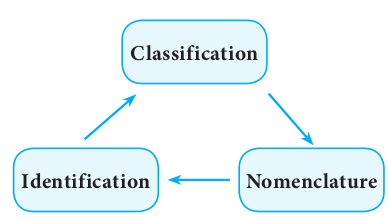
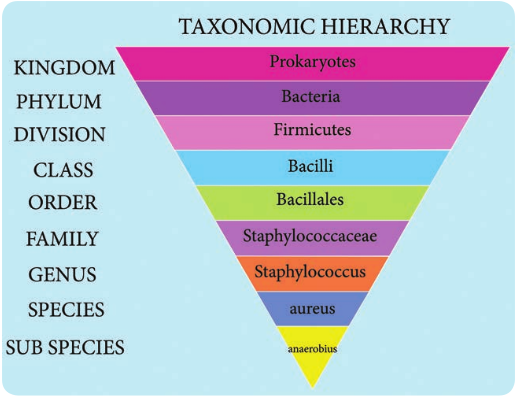
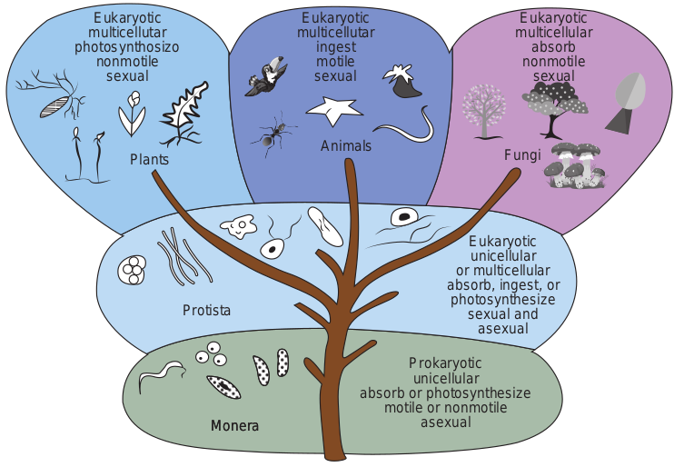

  

**Chapter** 8 **Microbial Taxonomy Chapter Outline**

**8.1** Diversity of Living Organisms is Fascinating

**8.2** Binomial Nomenclature **8.3** Whittaker’s System of Classification **8.4** Taxonomic Systems **8.5** The Three Domain System **8.6** The Past and Present Status of

Bacterial Taxonomy

## Diversity of Living Organisms is Fascinating

The branch of science which deals with the classification, nomenclature and identification of all living organisms is called Taxonomy. (Greek taxis means arrangements and nomos means law or to distribute). Because of large number and great diversity of organisms, biologists use

Eu- bac

Ba

A th

A si

A fiv

A tw

fun as res mi

After studying this chapter the student will be able,

_• To understand the concept of taxonomy, taxon and phylogeny._

_• To appreciate the contribution of Linnaeus and Whittaker._

_• To learn the characteristics of Kingdom Monera, Protista, Fungi, Plantae and Animalia._

_• To know some special methods used in classification of microorganisms._

**Learning Objectives**  

the characteristics of different organisms to identify and group them. To understand life, it is essential to understand taxonomy. The method of grouping related organisms is the basis of classification (Figure 8.1). The objectives of taxonomy are:

• To establish the criteria for identifying organisms

• To arrange related organisms into groups

• To provide evolutionary information of the organism The system of naming living organism

is called Nomenclature.

**Approaches to classifying organisms**

Plantae Animalia

Animalia

Animalia

Plantae

Plantae

Fungi

FungiProtistaArchae- bacteriateria

cteria Archaea Eukarya

ree-domain system–Woese

x-kingdom system – Woese

e-kingdom system – Whittaker

o-kingdom system – Linnaeus

ProtistaMonera

**Classification**

**Identification Nomenclature**

The correct identification of micro organisms is of damental importance to microbial systematists as well to scientists involved in many other areas of applied earch and industry (Example: agriculture, clinical crobiology and food production).

| Approaches to classifying organismsA two-kingdom system – Linnaeu s |
|------|------|------|------|------|------|------|------|------|------|------|
| Plantae |Animalia |
| A five-kingdom system – Whittake r |
| Monera |Protista |Fungi |Plantae |Animalia |
| A six-kingdom system – Woes e |
| Eu-bacteria |Archae-bacteria |Protista |Fungi |Plantae |Animalia |
| A three-domain system–Woese |
| Bacteria |Archaea |Eukarya |
| Th e  co r re c t  iden t if ic at io n  of  micr o  orga ni sm s  is  off un d amen t a l im p or t ance t o micr obi a l sys tem at ists a s w el las t o s cien t ists in volve d in m any o t her a re as o f a pplie dres e arch a nd in dust r y (E xa mple: a g r ic u ltur e, c linic a lmicr obio log y a nd f o o d p ro duc t io n). |
  

## Binomial Nomenclature

Swedish botanist Carolus Linnaeus in 1735 introduced a formal system of classification which divided all living organism into two kingdoms-Animalia and Plantae. He introduced “two name” system, the first name, genus and second name species. The name often gives information on something special about it. Taxa (the basic taxonomic group) are constructed from strains which are successions of cultures derived from an initial colony. The basic taxonomic group is called the species (a collection of strains having similar characteristics). The special bacterial strain which is the permanent reference specimen for the species is called the “**type strain**” (Figure 8.2).

Why is type strain refered as the most important strain in a bacterial species?

**HOTS**

A variant strain that differ physiologically and biologically from other strains in a particular species is called as “Biovar”. Variations in a species is biological in nature. One biovar in a species may grow on sucrose, while another cannot. If the biovars are very similar except for one property, they belong to the same genus and species, though vary in biological growth properties.

The strain that differ morphologically are called as Morphovar or Morphotypes. Serovars or Serotypes are those strains that differ in their antigenic properties. It refers to immunological variations in a species. An example of differing serovars is _Salmonella._ Cell surface of _Salmonella_ varies slightly from one serovar to another. Because of this cell surface change, a person who has been infected by or become resistant or immune to one serovar will not be immune to a second type, because the immune system cannot recognize a similar bacterium with a new surface cover.

ple of hierarchy in microbial taxonomy

  

The Microbial Type Culture Collection and Gene Bank (MTCC), a national facility established in 1986 is funded jointly by the Department of Biotechnology (DBT) and the Council of Scientific and Industrial Research (CSIR), Government of India. The MTCC, housed at the Institute of Microbial Technology (IMTECH), Chandigarh, has established itself as a distinguished culture collection centre for microbial resources in India. It is an affiliate member of the World Federation for Culture Collections (WFCC) and is registered with the World Data Centre for Microorganisms (WDCM). The main objectives of this national facility are to act as a depository, to supply authentic microbial cultures and to provide related services to the scientists working in research institutions, universities and industries.

**Infobits**

**Table 8.1** Properties of Whittaker’s five kingdo

**Kingdom Monera Protista Cell type** Prokaryotic Eukaryotic **Cell organization**

unicellular unicellular

**Cell Wall** Present in most Present in some absent in others

**Nutritional**

**Class**

Phototrophic, heterotrophicor chemoautotrophic

Heterotrophic and phototrophic

**Mode of nutrition**

Absorptive Absorptive or ingestive  

## Whittaker’s System of Classification

It is the five kingdom classification. In the 20th century, advances in cell biology and interest in evolutionary biology led scientists to question the two or three-kingdom classification schemes. In 1969, Robert H. Whittaker proposed a system which recognizes five kingdoms of living things: Monera (Bacteria), Protista, Fungi, Plantae and Animalia (Table 8.1).

Whittaker’s system of classification is based on 1) complexity of cell structure 2) mode of nutrition 3) body organization 4) phylogenetic or evolutionary relationship.

**Monera:** This kingdom includes all prokaryotic organisms. Unicellular microorganism such as Mycoplasma, Bacteria, Actinomycetes and Cyanobacteria are grouped under kingdom Monera.

Phylogeny is the evolutionary history of organisms that refer to the

relationship between life forms.

ms

**Fungi Plantae Animalia** Eukaryotic Eukaryotic Eukaryotic Multicellular and unicellular

Multicellular Multicellular

Present Present Absent

Heterotrophic Phototrophic Heterotrophic

Absorptive Mostly Absorptive

Mostly ingestive

| Kingdom |Monera |Protista |Fungi |Plantae |Animalia |
|------|------|------|------|------|------|
| C ell type |Prokar yotic |Eukar yotic |Eukar yotic |Eukar yotic |Eukar yotic |
| C ellorganization |unicellular |unicellular |Multicellularandunicellular |Multicellular |Multicellular |
| C ell Wall |Present in most |Present in some absent in others |Present |Present |Absent |
| NutritionalClass |Phototrophic, heterotrophicor chemoautotrophic |Heterotrophic andphototrophic |Heterotrophic |Phototrophic |Heterotrophic |
| Mode of nutrition |Absorptive |Absorptive or ingestive |Absorptive |Mostly Absorptive |Mostly ingestive |
  

**Hints of life:** The Precambrian was the age of microorganisms. They were macroscopically expressed in a colonial structure called **stromatolite**. It is a layer produced by live or fossilized mats of photosynthetic prokaryotes (cyanobacteria) associated with warm lagoons or hot springs. The ancient **stromalite** belongs to anoxygenic phototrophic filamentous bacteria and modern **stromalite** belongs to oxygenic photo trophic cyanobacteria.

**Infobits**

**Protista:** This kingdom includes eukaryotic unicellular Protozoans, slime molds and algae. The kingdom is made up of more than 250000 species. These

Eukaryotic multicellutar

photosynthosizo nonmotile

sexual

Plants

Protista

Monera

Anim

Eukary multice

inge moti sexu

organisms have typical eukaryotic cell organization.

**Fungi:** This kingdom includes non green, non photosynthetic eukaryotic fungi. molds, mushroom, toad stools, puffballs and bracket fungi are grouped under this kingdom. They are multicellular and consist of specialized eukaryotic cells arranged in a filamentous form.

**Plantae:** It includes all multicellular plants of land and water. They use photosynthesis to synthesize their organic molecules.

**Animalia:** This kingdom includes all multicellular eukaryotic animals. They are also referred to as Metazoans. Animals ingest their food through one of any ingestion portal and then use digestive enzymes to break food particles into absorbable fragments (Figure 8.3).

als Fungi

otic llutar st le al

Eukaryotic multicellular

absorb nonmotile

sexual

Eukaryotic unicellular

or multicellular absorb, ingest, or photosynthesize

sexual and asexual

Prokaryotic unicellular

absorb or photosynthesize motile or nonmotile

asexual

e Kingdom classification

  

## Taxonomic Systems

**Classical Taxonomy**

Classical taxonomy is a method of classification based on morphology, physiology, biochemical and ecological characteristics of the microorganisms. **• Morphological Characteristics:** The

structural characteristics are the usual tools which help in classification. Cell morphology gives little information about phylogenetic relationship. The first step in identification of bacteria is differential staining.

**• Physiological and metabolic characteristics:** These characteristics are useful because they are directly related to nature and activity of microbial enzymes and transport protein. Since proteins are gene products, analysis of these characteristics provides an indirect comparison of microbial genomes.

**• Biochemical characteristics:** Enzy- matic activities are widely used to differentiate bacteria. Bacteria can be separated into separate species by various biochemical tests. Example: Carbohydrate fermentation ability of bacteria.

**• Ecological characteristics:** Many properties are ecological in nature since they alter the relation of microorganism to their environment. Microorganisms living in various parts of the human body markedly differ from one another and from those growing in freshwater, terrestrial and marine environments.

Prokaryotes have only a few structural characteristics and these characteristics  

are subject to rapid change due to change in environment. In classifying prokaryotes, metabolic reactions, genetic relatedness and other specialized properties are used (Figure 8.4).

If two microorganisms have an identical mol% G+C value for their DNA, are they necessarily related? Explain

If two micro organisms have very different mol% G+C values for their DNA, are they necessarily unrelated? Explain

**HOTS**

**Numerical Taxonomy**

The objective classification system deals with the grouping by numerical methods of taxonomic units based on their character and does not use subjective evaluation of their properties. To be more objective about grouping bacteria, the scientists determine many characteristics (usually 100 to 200) for each strain studied, giving equal weightage for each character. Then by using computer **%similarity** is calculated **(%S** of each strain to every other strain). For any two strains, this is

%S 5 NS

NS 1 ND

where, NS is the number of characteristics that are the same (positive or negative) for the two strains, and ND is the number of characteristics that are different. Those strains having a high %S to each other are placed into groups; and those groups having a high %S to

  

groups. Numerical taxonomy also yields classification that has a high degree of stability and predictability.

In Numerical Taxonomy, which was defined by Peter H.A.Sneath and Robert Sokal, each

characteristic is given equal weightage and it is converted into numerical form and compared by means of a computer.

Atleast 50 and preferably several hundred characterictics are compared.

The presence and absence of selected characters in the group of organism is calculated by simple matching coefficient (SSM), called Jaccard coefficient.

Dispersion & Dilution

Non-selective & Selective agars

Incubate under appropriate atmospheric conditions

for various times

Colony count

Identification scheme

**Molecular Taxonomy**

Molecular techniques in the field of biology has helped to understand genetic relationship between the numbers of different taxonomic

categories. DNA and protein sequencing,

immunological methods, DNA-DNA or DNA-RNA hybridization methods are very helpful in studying different species.

The data or information from such studies are used to construct phylogenetic tree (a branching diagram showing the evolutionary relationship among various biological species based on similarities and difference in their physical or genetic characteristics).

DNA extraction

16S rRNA gene amplification with universal primers

Cloning & partial sequencing

Search for homology in database

Construction of specific probes for subsequent

analysis

and identification in microbial taxonomy

  

A classification technique that is widely used is DNA base composition which is expressed as the percentage of Guanine plus Cytosine (G+C). It is a fixed property that reveals the degree of species relatedness. Ribosomal RNA sequencing is used to determine the diversity of organisms and the phylogenetic relationship. Basically ribosomes consists of two subunits, each of which is composed of protein and a type of RNA. Specific base sequences called as signature sequences are found in all groups of organisms. These unique DNA sequences are 5-10 bases long and found in 16s rRNA location and unique to major groups of prokaryotic organisms.

Nucleic acid based detection methods help in the detection of genomic materials. The 16s rRNA gene sequencing has been established as the “gold standard” for

identification & taxonomic classification of microbial species.

## The Three Domain System

This system of classification was introduced by C.Woese, O. Kandler and M.L.Wheelis, is an evolutionary model of phylogeny based on cells rRNA sequences(differences in the sequences of nucleotides) studies. They grouped all living organisms into three domains: Bacteria, Archaea and Eukaryota (Figure 8.5).

Bacteria and Archaea are two different groups of prokaryotes. The domain Bacteria comprise the vast majority of prokaryotes. The domain Archaea contains prokaryotes that live mostly in extreme environments. The domain Eukaryota contains living organisms that includes Kingdom Protista, Kingdom Fungi, Kingdom Plantae and Kingdom

A analysis. Organisms are classified into otes as proposed by Carl Woese et al.

  

The **_Bergey’s Manual of Systematic Bacteriology_**_’s_ first edition was published initially in four volumes. Volume 1 included Gram negative bacteria of general, medical or industrial importance, Volume 2 included Gram positive bacteria other than actinomycetes, Volume 3 included Cyanobacteria, Archaebacteria and remaining Gram negative bacteria and Volume 4 included Actinomycetes.

The current grouping edition 2 (2012) has five volumes based on 16S rRNA sequencing:

Volume 1 (2001) includes Archaea and the deeply branching and phototrophic Bacteria.

Volume 2 (2005) includes Proteobac- teria.

Volume 3 (2009) includes Firmicutes. Volume 4 (2011) includes

Bacteroidetes, Spirochaetes, Tenericutes (Mollicutes), Acidobacteria, Fibrobacteres, Fusobacteria, Dictyoglomi, Gemmatimonadetes, Lentisphaerae, Verrucomicrobia, Chlamydiae, and Planctomycetes.

Volume 5 (in two parts) (2012) includes Actinobacteria.

**Infobits**

Animalia. This system of classification is currently accepted by most biologist.

The three domain system is based on the current state of knowledge. As knowledge of organisms increase in the future, classification will undoubtedly continue to change.  

## The Past and Present State of Bacterial Taxonomy

The first classification scheme for bacteria was published in 1773 based on morphological characteristics. One of the unique, broadscope and widely accepted classification scheme was published in 1927 by David Bergey & colleagues is Bergey’s Manual of Determinative Bacteriology.

It provides identification schemes for identifying Bacteria and Archae based on their morphology, differential staining and biochemical tests. Whereas in 1984, a more detailed work was entitled. Bergey’s manual of Systematic Bacteriology provides information on Bacteria and Archaea based on rRNA sequencing. The classification in Bergey’s Manual is accepted by the most microbiologists as the best consensus for prokaryotic taxonomy.

The present classification scheme based on genetic relatedness has more practical value. This is expected to provide greater stability and predictability. It would lead to improved identification schemes, and to aid our understanding of the origin of present day genera and species.

**Summary**

The branch of science which deals with the classification, nomenclature and identification of all living organisms is called taxonomy. The system of naming living organisms is called as nomenclature. Carolus Linnaeus divided all living organisms into two kingdoms- Animalia and Plantae. He introduced Binomial Nomenclature for naming living organisms. Whittaker

  

proposed five kingdom classification based on various properties of living organisms. Currently accepted classification proposed by Woese, Kandler and Wheelis is the three domain classification. Modern developments of sequencing technologies and recognition of rDNA sequences are of now cornerstone for identification purposes.

Overall, it is important to recognize that microbial diversity is very much

**Student Activity**

The student must understand the charac kingdom classification and fill in the chart  

linked to its environment and the correlation has to be established by description of environmental parameters whenever sampling is carried out. It is also important to study the phenotypic characteristics and link them to the observations obtained from genotyping techniques. The link between habitat and diversity then becomes easier to understand for future studies.

teristics of each domain under the five below.

  

**Evaluation**

**Multiple choice questions**

1\. Which of the following is a reasonable repre- sentation of phyloge- netic diversity? a. The Chain of Being b. The Ladder of Life c. The 5-Kingdom Tree d. The 3-Domain Tree

2\. Microorganisms belonging to the same are expected to have the most characteristics in common with eachother. a. Order b. Species c. Family d. Kingdom

3\. What was the first and most useful microscopic tests for classifying bacteria? a. Gramstain b. Flagellar stain c. Simple stain d. Capsular stain

4\. Which of the following is the arrangement of organisum into groups or taxa? a. Nomenclature b. Identification c. Systematics d. Classification  

5\. Binomial nomenclature means writing the name of microorganism in two words is a. Order and family b. Family and genus c. Species and variety d. Genus and species

**Answer the following**

1\. Define: Taxonomy and what is the here inter related parts of taxonomy?

2\. Define: Classification, Nomenclature and Identification.

3\. What is meant by binomial system? 4. Who developed the Bionomial system

in the year? 5. What is taxonomic rank and why are

we using this? 6. What is the difference between

biovars, serovars and morphovars? 7. What is type strain and why it is called

as type strain? 8. Write down the techniques which

are used to identify the taxonomic characters of an organism?

9\. Explain in detail about the molecular characteristics which are used to identify the taxonomic orders?

10\. What are the five kingdom classifica- tions?

