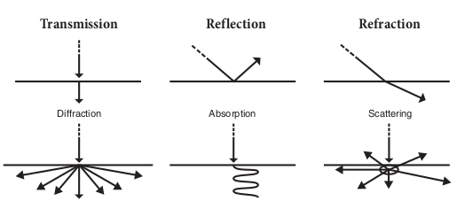
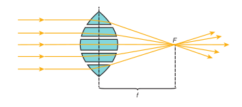
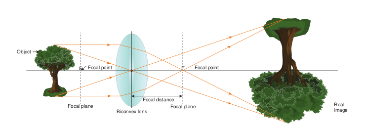
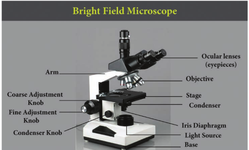
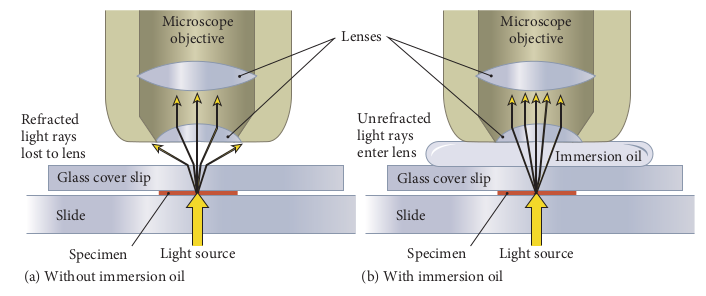
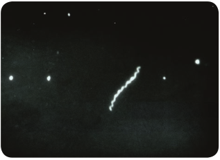

  

**Chapter** 2 **Microscopy Chapter Outline**

**2.1** Historical Background

**2.2** Principles of Microscopy

**2.3** Bright Field Microscope

**2.4** Dark Field Microscope

by mi pro an mi me

## Historical Background
 Antony Van Leeuwenhoek (1632-1723) was the first person to use a simple microscope with one lens similar to a magnifying glass. The lens is capable of 50X to 300X magnification.

After studying this chapter the student will be able,

_• To know the properties of light and lens._

_• To know the science of image formation in brightfield microscopy._

_• To understand the design of light microscope._

_• To learn and compare the principle, instrumentation and working of brightfield and darkfield microscopy._

**Learning Objectives**  

Robert Hooke, built compound microscopes with multiple lenses. In 17th century, Dutch spectacle maker Zaccharias Janssen is given the credit for making first compound microscope. However, the early compound microscopes were poor in quality. In 1830, Joseph Jackson Lister (the father of Joseph Lister who practised antiseptic surgery) made significant development which resulted in the invention of modern compound microscope used in microbiology today.

## Principles of Microscopy

All kind of microscopes use visible light to observe specimens. Light has a number of properties that affect our ability to visualise objects.

### Properties of Light

Light is a part of the wide spectrum of electromagnetic radiation from the sun. It is a form of energy. The most important property of light is wavelength (the length

Microorganisms are very small and cannot be viewed human eye. The microscope helps in observing the crobial world which exists in a wide range of sizes. The karyotes (bacteria and archae) are smaller (~ 0.4-10µm)

d the eukaryotes are larger (~ or >10µm). The word croscope is derived from the Latin word _micro_, which ans small, and the Greek word skopos means _to look at._

  

of light ray) (Figure 2.1).

One wavelength Wave Crest

Wave trough

The sun produces a continuous spectrum of electromagnetic radiation with waves of various lengths (Figure 2.2). Radiation of longer wavelength includes Infrared (IR) and radiowaves, the shorter wavelengths include Ultra Violet (UV) rays and X-rays.

The physical behaviour of light can be caterigorised as either light rays,

400 nm

Transmission Reflec

Visibl

X-rays UV

1× 10

\-6 n

m

1× 10

\-2 n

m

10 n

m

40 0

nm

Increasing wavelength

(wave

Diffraction Absorp

**Transmission Reflec**  

light waves or light particles. The combined properties of particle and wave enable light to interact with an object in several different ways like transmission, absorption, reflection, refraction, diffraction and scattering (Figure 2.3).

### Lenses and its Properties
 Lenses are optical devices which focus or disperse a light beam by means of refraction. A simple lens consists of a single piece of transparent material. Light rays from a distant source are focused at the focal point F. The focal point lies at a distance **f** (focal length) from the lens’ centre (Figure 2.4).

tion Refraction

e light 700 nm

IR Microwave Radio and TV

70 0

nm

1 nm

10 c

m

10 0

km

Increasing frequency length)

hite light is a combination of all colours of ectrum

tion Scattering

n of light with matter

**tion Refraction**

  

M i c r o o r g a n i s m s are measured in micrometers and nanometers. The

average bacterial cell is 0.001mm in diameter.

_F_

_f_

**Generating an image with a lens** When an object is placed outside the focal plane (the plane containing the focal point of the lens), all the light rays from the object are bent by the lens. The bent rays converge at the opposite focal point. At the focal point, the light rays continue and converge with nonparallel refracted light rays. The resultant reversed and magnified image is formed in the plane of convergence (Figure 2.5).

Focal plane Focal p

Focal pointF F

Object

Focal distance

Biconvex lens

**Microscope resolution** Objective is the important part in the microscope which is responsible to produce a clear image. The resolution of the objective is most important. Resolution is the capacity of a lens to separate or distinguish between small objects that are close together. The major factor in the resolution is the wave length of light used. The greatest resolution obtained with light of the shortest wave length, that is the light at the blue end of the visible spectrum are in the range of 450 to 500nm. The highest resolution possible in compound light microscope is about 0.2µm. That means, the two objects closer together than 0.2µm are not resolvable as distinct and separate. The light microscope is equipped with three or four objectives. The working distance of an objective is the distance between the front surface of the lens and the surface of the cover glass or the specimen. Objectives with large numerical apertures and great resolving power have short working distances.

**Numerical aperture** Numerical Aperture (NA) is the value representing the light gathering capacity of an objective lens. NA was first described

lane

Focal point

Real image

’

an image with a lens

|------|------|------|------|------|
| F |

  

by Ernst Abbe, and is defined by the following expression

_F_

_f_

_D (Diameter of lens)_

Numerical Aperture (NA) =n × sin(θ) n = the refractive index of the medium between the specimen and objective; θ = half aperture angle or collection angle of the objective. (the maximum half angle of the cone of light that can enter or exit the lens).

The smallest cells on the planet are some forms of _Mycoplasma_ with dimensions of 0.2 to 0.3 µm, which is within the limit of resolution of light microscopes. Tiny cells that look like dwarf bacteria but are 10 times smaller than _Mycoplasma_ and 100 times smaller than the average bacterial cell are called nanobacteria or nanobes (_Greek_ nanos means one billionth).

**Infobits**

The resolving power of a light microscope depends on the wavelength of light used and the NA of the objective lens.

The numerical aperture of a lens can be increased by

• Increasing the size of the lens opening and/or

• Increasing the refractive index of the material between the lens and the specimen.  

The larger the numerical aperture the better the resolving power. It is important to illuminate the specimens properly to have higher resolution. The concave mirror in the microscope creates a narrow cone of light and has a small numerical aperture. However, the resolution can be improved with a sub stage condenser. A wide cone of light through the slide and into the objective lens increases the numerical aperture there by improves the resolution of the microscope.

**Types of microscopes** In order to view microorganism and microbial structures of different sizes we require different kinds of microscopes.

• Light microscopes resolve images with the help of light. The specimen is viewed as dark object against a light background in bright field microscope. Dark field microscope uses a special condenser and the specimen appears light against a black background. The other types of mircoscopes are Phase contrast and Fluorescence microscope.

• Electron microscope uses a beam of electrons instead of light. Electrons pass through the specimen and form a two dimensional image in Transmission Electron Microscope (TEM). Electrons are reflected from the specimen and produce a three dimensional image in Scanning Electron Microscope (SEM).

## Bright Field Microscope

The most commonly used microscope for general laboratory observations is the standard bright field microscope (Figure 2.6). It contains the following components

• A mirror or an electric illuminator is the light source which is located at the base of the microscope.

|------|------|

  

• There are two focusing knobs, the fine and the coarse adjustment knobs which are located on the arm. These are used to move either the stage or the nosepiece to focus the image.

• Mechanical stage is positioned about half way up the arm, which allows precise contact on moving the slide.

• The substage condenser is mounted within or beneath the stage and focuses a cone of light on the slide. In the simpler microscope, its position is fixed where as in advanced microscope it can be adjusted vertically. The upper part of microscope arm holds

the body assembly. The nose piece and one or more eyepieces or oculars are attached to it. The body assembly contains series of mirrors and prisms so that the barrel holding the eyepiece may be tilted for viewing. Three or five objectives with different magnification power are fixed to the nosepiece and can be rotated to the position beneath the body assembly. In bright field microscopy; the specimen is viewed against a bright background. The details of the image are defined by the surrounding light. A series of finely ground lenses forms an image

which is many times larger than the real image. This magnification occurs when light rays from an illuminator (light source), pass through a condenser which has lenses that direct the light rays through the specimen. The light rays then pass into objective lens (the lens closest to the specimen). The image is again magnified by the ocular lens or the eyepiece. (Figure 2.7). • Magnification is the process of

enlarging the image of the specimen and can be calculated by multiplying the objective lens magnification power by ocular lens magnification power. Representative magnification values for a 10X ocular are: Scanning objective (4X) × (10X) = 40X magnification Low power objective (10X) × (10X) = 100X magnification High dry objective (40X) × (10X) = 400X magnification Oil immersion objective (100X) × (10X) = 1000X magnification

cope

  

Illuminator

Condenser lenses focus light rays through specimen.

Stage supports microscope slide

Objective lenses (those closest to specimen) form the primary image. Most compound light microscopes have several.

Ocular lens enlarges primary image formed by objective lenses.

Prism that directs rays to ocular lens

Path of light rays (Bottom to top) to eye

Refracted light rays lost to lens

U li e

Len Microscope

objective

Glass cover slip

Slide

Specimen (a) Without immersion oil (

Light source

**Oil Immersion**

Oil immersion lens is designed to be in direct contact with oil placed on the cover slip. An oil immersion lens has a short focal length and hence there is a short working distance between the objective lens and the specimen. Immersion oil has a refractive index closer to that of glass than the refractive index of air, so the use of oil increases the cone of light that enters the objective lens. Figure 2.8 explains the working principle of oil immersion objective lens.

• What are the two ways by which the resolving power of microscope can be enhanced?

• What are the advantages of the low-power objective over the oil immersion objective for viewing fungi or algae?

• What will happen if water is used instead of immersion oil under a 100X objective lens?

**HOTS**

Immersion oil

nrefracted ght rays nter lens

ses Microscope

objective

Glass cover slip

Slide

b) With immersion oil Specimen Light source

bjective Working Principle

|------|------|------|

| objective |
|------|------|------|------|------|------|------|------|------|

| Immersion oil |
| Glass cover slip |

| Glass cover slip |
|------|------|
| Slide |
  

## Dark Field Microscope

This is used for examining live unstained microorganisms. The distinct feature is the dark field condenser that contains an opaque disc. The disc blocks direct entry of light to the objective lens. The light rays reflected off the specimen enter

Abb con

(a)

(b)

Compound microscope (also known as light microscope) produces a mono (2D) image and stereo microscope produces stereo (3D) image. ‘Upright’ life science microscopes are the most numerous of all microscopes. An inverted microscope is the kind of microscope that views objects from an inverted position. Digital microscopes are becoming widespread. These provide simple image and are convenient for electronic image capturing.

**Infobits**  

Objective

Specimen

e denser

Dark-fields stop

est way to convert a microscope to dark field underneath (b) the condenser lens system

the objective lens and in the absence of direct background light, the specimen appears light against a dark background (Figure 2.9). The microbes are visualized as halos of bright light against the darkness, as stars are observed against the night sky (Figure 2.10).

from a patient with Syphilis

|------|------|

|------|------|------|

  

**ICT CORNER**

**Step2Step1**

**SEM**

**URL:** http://myscopeoutreach.org

**Lets focus with SEM**

**STEPS:** • Use the URL or scan the QR code to r • Click ‘The Scanning Electron micros

its parts and function. • Follow the successive steps that lead t • Select ‘Let’s Zoom in’ under the a

stimulations.

**Summary** The microscope is a tool to study small microscopic life forms. Zaccharias Janssen is given the credit for making first compound microscope. Light microscopy has undergone a renaissance during the later years of the 20th century and early stages of 21st century.

There are two main types of microscopes (i) Light microscope and (ii) Electron microscope. Light microscope makes use of light and Electron microscope uses the electrons.  

**Step3**

each ‘myscope outreach’ interactive page. cope’ under ‘Basic’ menu to know about

o describe the n nuances of SEM. ctivity to menu and explore the SEM

**Evaluation**

**Multiple choice questions** 1\. The credit for inventing

the first compound microscope goes to

a. Robert Hook b. Anton von Leewenhoek c. Kepler and Galileo d. Zaccharias Janssen

  

Flashlight

Objecct

Meter stic

_o_

**Student Activity**

Experiment and enjoy…… **Imaging Properties of a Simple Lens Objective:** In this experiment you will obser simple lens. **Apparatus:** You will need a good lens (magn (tri-folded white copy paper), a meter stick things in place. Set all these things on a flat ta lighting can be dimmed.

2\. All the following are components of compound microscope except

a. Stage clips b. Fine adjustment knob c. Electron gun d. Binocular eye piece

3\. Numerical aperture was first described by a. Robert Hook b. Anton von Leewenhoek c. Ernst Abbe d. Zaccharias Janssen

4\. The resolving power of light microscope is a. 1 cm b. 1.0 µm c. 0.2 µm d. 2 nm

**Answer the following** 1\. What is the importance of microscopy in

microbiology?

2\. Write down the names of different types of microscopes.

3\. What principle defines an object as “microscope”?  

Lens

k

Image

Screen

_i_

ve and measure the imaging properties of a

ifying glass), a flashlight, a viewing screen and perhaps some modeling clay to hold ble about 1 meter wide in an area where the

4\. What happens to light rays when they interact with an object?

5\. Elucidate the lens function in image formation.

6\. Define the characteristics of resolution, magnification and numerical aperture.

7\. How do eukaryotic and prokaryotic cells differ in appearance under the light microscope?

8\. Trace the pathway of light in brightfield microscopy.

9\. Elaborate the role of condenser and image formation in dark field microscope.

|------|------|------|

