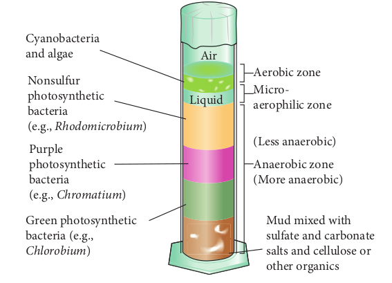
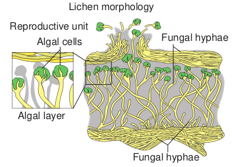
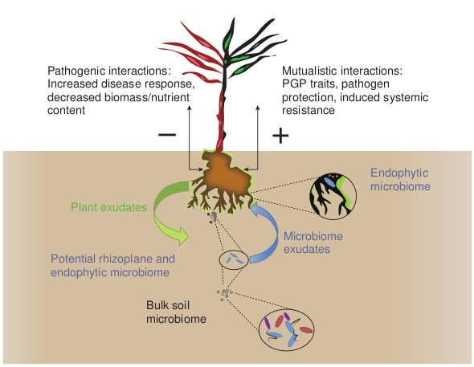
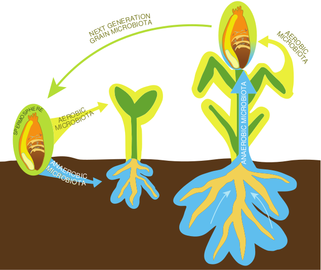

  

Knowledge of Soil Microbiology is essential to understand the agricultural and environmental science. Without soil microorganisms, life as we know could not exist on earth. Organic matter would accumulate in the form of undecomposed substances. Why should we study soil Microbiology? If we understand what is happening in soil, we get a better idea of how other biological systems work on earth.

After studying this chapter the student will be able,

_• To know the composition of soil. • To understand the importance of_

_soil microorganisms in soil fertility. • To learn about the beneficial and_

_harmful interaction between soil microorganisms._

**Chapter** 10 **Soil Microbiology Chapter Outline**

**10.1** Soil in General

**10.2** Pioneers of Soil Microbiology

**10.3** Components of Soil

**10.4** Soil Microorganisms

**10.5** Microbial Interactions

**10.6** Rhizosphere

**10.7** Phyllospere

**10.8** Spermosphere

**Learning Objectives**

wh in of

Soil c

M  

## Soil in General

Soil is the outer covering of the earth. It consists of loosely arranged layer of materials composed of inorganic and organic constituents. Soil provides the physical support needed for the anchorage of root system and serves as the reservoir of air, water and nutrients that are essential for plant growth.

### Formation of Soil

The processes involved in the formation of soil are slow, gradual and continuous. The sum total of environmental effects on rocks collectively known as the weathering of rocks. Weathering of rocks is a continuous phenomenon and add more and more soil to the surface of the earth. There are different types of parent materials of rocks available for the formation of soil.

Soil is inhabited by a living microscopic population ich is responsible for the numerous reactions taking place the soil. The soil microorganisms affects the life economy man in many ways.

Microfungi on leaf surfaceMillipede

Ground BeetleEarthworm

Mite Fungal hyphae in soil

Fungus feeding on nematode

Springtail

Bacteria

rust microbes

icrofungi in soil

Nematode Protozoa

Spider

  

### Soil Horizons

Each type of soil is characterized by the presence of different horizons which can be seen in a soil profile (Figure 10.1). The formation of soil horizons depends on climate, living organisms, parent rock material, topography and time; all of which control the weathering of rocks.

### Physical and Chemical Properties of Soil

Physical properties of a soil type depends on the size of particles, soil texture, soil temperature and soil pH.

Chemical properties of soil includes three main components which provides nutrients for plant growth. The three components are the organic matter, the derivatives of parent rock materials and the clay fraction.

The fertility of soil depends not only on its chemical composition, but also on the qualitative and quantitative nature of microorganisms inhabiting it. The branch  

oil Horizons

of science dealing with study of soil microorganisms and their activities in soil is known as '**Soil Microbiology**'.

## Pioneers of Soil Microbiology

Scientists studied the microorganisms from water, air and soil. They recognized the role of microorganisms in natural processes. They realized the importance of soil microorganisms in growth and development of plants. Soil Microbiology emerged as a distinct branch of soil science during first half of the 19th century.

Sergei N. Winogradsky discovered the autotrophic mode of life among bacteria and established the microbiological transformation of Nitrogen and Sulphur. He isolated nitrifying bacteria for the first time and demonstrated the role of these bacteria in nitrification (1890). Further he demonstrated that free-living _Clostridium pasteurianum_ could fix atmospheric Nitrogen (1893). He developed the Winogradsky column (Figure 10.2), a self contained ecosystem for studying the

  

Purple photosynthetic bacteria (e.g., _Chromatium_)

Nonsulfur photosynthetic bacteria (e.g., _Rhodomicrobium_)

Cyanobacteria and algae

Green photosynthetic bacteria (e.g., _Chlorobium_)

A

Liq

Sulphur cycle. Therefore, he is considered as the '**Father of Soil Microbiology**'.

M. W. Beijerinck (1888) isolated root nodule bacteria in pure culture from nodules in legumes and named them as _Bacillus radicola._ Thus, he is considered as the '**Father of Microbial ecology**'.

Beijerinck and Winogradsky (1890) developed the enrichment culture technique for isolation of soil organisms, proved independently that transformation of nitrogen in nature is largely due to the activities of various groups of soil microorganisms (1891). Therefore, they are considered as '**Pioneers in Soil Bacteriology**'.

## Components of Soil

**The soil is composed of five major components**

• Mineral matter • Water • Air  

• Organic matter • Living organisms

One gram of soil contains approximately one million microorganisms. The soil has organic matter, soil solution and soil air. All these components are affected by the activities of microorganisms. Soil is a constantly changing medium. The soil solution in agricultural soil has ions like K+, Na++, Mg++, Ca++, Fe+, S-, NO3, SO4, PO4 and others.

These ions are very essential in culture media. In a fertile soil, these elements in mineral form are supplemented by organic compound, derived from the decomposition of animal and plant residues. Thus the soil is an excellent natural medium for growth of microorganisms.

## Soil Microorganisms

Soil contain five major groups of microorganisms. They are Bacteria, Actinomycetes, Fungi, Algae and Protozoa (Table 10.1).

Aerobic zone Micro- aerophilic zone

(Less anaerobic)

Anaerobic zone (More anaerobic)

Mud mixed with sulfate and carbonate salts and cellulose or other organics

ir

uid

gradsky column

  

**Table 10.1:** Soil Microorganisms with example

**Soil Microorganisms Examples**

**Bacteria** _Agrobacterium Bacillus Clostridium Pseudomonas_

**Actinomycetes** _Actinomyces Nocardia Streptomyces_

**Fungi** _Aspergillus Fusarium Alternaria Cladosporum_

**Soil algae** _Anabaena Oscillatoria Nostoc_

**Protozoa** _Colpoda Nematodes Pleurotricha Heteromita_

**Bacteriophages** T4 Bacteriophages

One teaspoon of productive soil can contain between 100 million and 1 billion

bacteria. These living microorganisms recycle organic material, promoting soil fertility and supporting plant growth. By practicing conservation tillage, farmers can maintain biodiversity in their soil.

**Soil Bacteria**

Among the soil microorganisms, bacteria are most dominant group of organisms. All kinds of bacteria are found in soil.  

This is because all kinds of organic refuse are disposed on the soil

Many of the soil bacteria perform useful functions like decomposition of organic matter, conversion of soil constituents into useful materials, production of antibiotics in the soil and biogeochemical cycling of elements like Carbon, Nitrogen, Phosphorus, Iron, Sulphur and Manganese. The bacterial population of the soil exceed the population of all other groups of microorganisms in both number and variety.

**Soil Actinomycetes**

The actinomycetes population is present as many as millions per gram of soil. The most predominant genera present in the soil are _Nocardia, Streptomyces_ and _Micromonospora_. Actinomycetes are capable of degrading many complex organic substances and therefore play an important role in building soil fertility. One of the most notable characteristics of the actinomycetes is their ability to produce antibiotics. Examples: Streptomycin, neomycin, erythromycin and tetracycline.

**Soil Fungi**

Next to bacterial population in soil, fungi dominates in all kinds of soil. It possess filamentous mycelium composed of individual hyphae. All environmental factors which influence the distribution of bacteria and actinomycetes also influence the fungal flora of soil. The quality and quantity of organic matter present in the soil have a direct influence on the fungal numbers in soil. Fungi are dominant in acidic soils because acidic environment is not supportive for the existence of either bacteria or actinomycetes.

| Soil Microorganisms |Examples |
|------|------|
| Bacteria |AgrobacteriumBacillusClostridiumPseudomonas |
| Actinomycetes |Ac tino myce sNoc ardiaStreptomyces |
| Fungi |Aspe rg ill u sFu s ar iumAlte rn ari aC la do spo r um |
| Soil algae |Anabae naOs c illator iaNosto c |
| Protozoa |C olpodaNe matode sPle urot r ich aHete romita |
| Bacteriophages |T 4 B ac ter io phages |
  

**Soil microbes create humus:** Humus is the dark organic matter in soil. The

humus is formed when dead plant and animal matter are decayed by soil microorganisms. Humus has many nutrients that improve the fertility of soil, Nitrogen being the most important.

Humus helps soil to retain moisture, and encourages the formation of soil structure. Soil organisms promote plant growth.

**Soil Algae**

Soil algae are ubiquitous in nature wherever moisture and sunlight are available. They are visible to the unaided eye in the form of green scum on the surface of soils. Numerically, they are not as many as Fungi, Bacteria or Actinomycetes. Some of the common algae in Indian soil are _Chlorella, Chalmydomonas, Chlorochytrium, Chlorococcum_ and _Oedogonium_.

Blue green algae, or _Cyanophyceae,_ are responsible for Nitrogen fixation. The amount of Nitrogen they fix depends more on physiological and environmental factors rather than the organism’s abilities. These factors include intensity of sunlight, concentration of inorganic and organic Nitrogen sources and ambient temperature and stability.

**Soil Protozoa**

Soil protozoa are unicellular. They are characterized by a cyst in their life cycle which can help the species to withstand  

adverse soil conditions. The protozoans prefer certain species of bacteria for their nutrition. Protozoa are abundant in the upper layer of the soil and their numbers are directly dependent on bacterial population.

“Without fungi even death will be incomplete” - Pasteur Justify the statement.

**HOTS**

### Factors Influencing Microbial Population in Soil

The major factors that influence the microbial community in soil are • Moisture • pH • Temperature • Gases • Organic and inorganic fertilizer • Organic matter of soil • Types of vegetation and growth stages • Ploughing • Season • Depth of soil

Some soil microbes produce a variety of substances that promote plant growth, including Auxins, Gibberellins and antibiotics.

**Infobits**

## Microbial Interactions

Microorganisms in soil interact with themselves and lead to beneficial and

  

**Table 10.2:** Types of microbial interaction in

**Interaction Microorga**

Neutralism No ef

Commensalism +

Amensalism No ef

Mutualism Synergism

Protoco-operation Symbiosis

+

Competition -

Parasitism +

Predation +

\+ = positive effect – = negative effect

harmful relationships (Flowchart 10.1). Some of the interaction and interrelationship have been discussed in this connection in Table 10.2.

Microbial interactions

Beneficial interactions

Symbiosis Commensalism

Protocooperation

Parasitism Amensalism Competition

Harmful interactions

**Flowchart 10.1:** Microbial interactions

### Beneficial Interactions

The beneficial interactions such as symbiosis (mutualism) and commensalism are found to operate among the soil inhabitants.  

**Symbiosis (mutualism)** Mutualism is an example of symbiotic relationship in which each organisms benefits from the association. One type of mutualistic association is involving the exchange of nutrients, between two species, a phenomenon called syntrophism. Many microorganisms synthesise vitamins and amino acids in excess of their nutritional requirements. Other have a requirement for one or more of these nutrients. Symbiosis is an obligatory relationship between two populations that benefit both the population. Both populations live together for mutual benefit.

A B

soil

**nisms A Microorganisms B**

fect No effect

No effect

fect -

+

\-

\-

\-

| Microbial interactions |
|------|------|------|------|------|

| icial  Harmftions interac |
| B enef ul interac tions |

| B eneficial interactions |
|------|------|------|

| Symbiosis Commensalism Protocooperation |

|------|------|
| Parasitism Amensalism Competition |

| Inter a c ti on |Mi cr o org anis ms A |Mi cr o org anis ms B |
|------|------|------|
| Neu t ra li sm |No ef fe c t |No ef fe c t |
| C omm en s a li sm |+ |No ef fe c t |
| Amen s a li sm |No ef fe c t |- |
| Mutu a li smSy ner g ismProto co-o p era t io nSy mbiosi s |+ |+ |
| C omp e t it i on |- |- |
| Para si t ism |+ |- |
| Pred ati on |+ |- |
| + = p osi t ive ef fe c t– = n ega t ive ef fe c t |
  

The relationship between algae and fungi that result in the formation of lichen is a classical example of mutualistic intermicrobial relationship (Figure 10.3).

Lichens are composed of primary producer, the phycosymbiont (algae) and a consumer the mycosymbiont (fungus)

Algal layer

Algal cells

Reproductive unit Fungal hyphae

Lichen morphology

Fungal hyphae

**Commensalism** In a commercial relationship between two microbial population, one population is benefited and other population remains unaffected. Commensalism is an unidirectional relationship between two population. The unaffected population does not benefit by the action of second population. For the receiving population, the benefit provided may be essential. In commensalism, the unaffected population modifies the habitat in such a way that another population is benefited.

A B

Benefits

Benefits

For example: A population of facultative anaerobes utilizes oxygen and creates a habitat suitable for the growth of anaerobes. In soil, vitamin and growth factor  

producing organisms benefit vitamin and growth factors requiring organisms.

### Harmful Microbial Interactions

Harmful microbial interaction is otherwise described as negative interaction or antagonistic interaction. Any inhibitory effect of an organism created by any means to the other organism is known as harmful interaction or antagonistic interaction and the phenomenon of this activity is called antagonism

**Ammensalism** Ammensalism is the phenonmenon where one microbial species is affected by other species, where as other species is unaffected by first one. Ammensalism is accomplished by secretions of inhibitory substances such as antibiotics. Certain organisms may be of great practical importance, since they often produce antibiotics or other inhibitory substances, which affect the normal growth of other organisms. Antagonistic relationships are quite common in nature. For example: _Pseudomonas aeruginosa_ is antagonistic towards _Aspergillus terreus_ (Figure 10.4).

**Parasitism** This is a relationship in which one of the population benefits from the other and the host is usually harmed. Parasitism

  

is one of the most complex microbial interactions. The line between parasitism and predation is difficult to define. The parasites feed on the cells, tissues or fluids of another organisms the host, which is harmed in this process.

A B Harms

Benefits

The parasites depends on the host and lives in intimate physical and metabolic contact with the host. All types of plants and animals are susceptible to attack by microbial parasites.

Cortex

Epidermis

Endodermis

Root cap

Stele (xylem↑, phloem↓)

The rhizospere region can be divided into two zones.

• Exorhizosphere • Endorhizophere However the root surface is termed as

“rhizoplane”.  

## Rhizosphere

In 1904, L.Hiltner for the first time coined the term “rhizosphere” to denote the area of intense microbiological activity that extends several millimeters from the root system of the growing plants.

The region which is adjacent to the root system is called rhizophere. The microbial population on and around root system is considerably higher than the root free soil or non rhizophere soil. This may be due the availability of nutrients from plants root in the form of root nodules, secretion, lysates, mucigel and sloughed off cells (Figure 10.5).

Plant mucilage

Mucigel (plant & bacterial mucilage)

Root hair

Rhizosphere 5 mm

Rhizoplame

Sloughed root cap cell

ir and Rhizosphere

**Rhizophere Effect**

The rhizophere is a zone of increased microbial community as well as microbial activities influenced by the root itself.

Greater rhizosphere effect is seen with bacteria (R: S values ranging from

  

Pathogenic interactions: Increased disease response, decreased biomass/nutrient content

Bulk soil microbiome

Plant exudates

Potential rhizoplane and endophytic microbiome

**Bioleaching:** Soil microorganisms are very closely involved as catalytic agents in many geological processes. These include mineral formation, mineral degradation, sedimentation and geochemical cycling. In recent years, a new discipline of mineral science namely bio-hydrometallurgy or microbial mining (mining with microbes) is rapidly growing. Broadly speaking, bio-hydrometallurgy deals with the application of biotechnology in mining industry. In fact, microorganisms can be successfully used for the extraction of metals (Example: copper, zinc, cobalt, lead, uranium) from low grade ores. Mining with microbes is both economical and environmental friendly.

**Infobits**  

10 to 20 or sometimes more) than with actinomycetes or fungi (Figure 10.6). From the agronomic point of view, the abundance of Nitrogen fixing and Phosphate solublising bacteria in the rhizosphere of crop plants assumes a natural significance.

It has been reported that amino acid requiring bacteria exist in the rhizosphere in large numbers than in the root free soil. The rhizosphere effect improves the physiological conditions of the plant and ultimately result in higher yield.

## Phyllosphere

The term “Phyllosphere” was coined by the Dutch Microbiologist Ruinen. The leaf surface has been termed as Phylloplane and the zone on leaves inhabited by the microorganisms as Phyllosphere (Figure 10.7). In forest vegetation, thick microbial epiphytic

Mutualistic interactions: PGP traits, pathogen protection, induced systemic resistance

Endophytic microbiome

Microbiome exudates

zosphere in plant growth

  

associations exist on leaves. The dominant and useful microorganisms on the leaf surfaces in the forest, vegetation happened to be Nitrogen fixing bacteria like _Beijerinckia_ and _Azotobacter_.

Apart from Nitrogen fixing bacteria, other genera such as _Pseudomonas,_

PGPB can promote plant growth. The bacte that form specific symbiotic relationships wi bacterial endophytes that can colonize some cyanobacteria (blue-green algae). PGPB may either facilitating resource acquisition or mo by decreasing the inhibitory effects of vario development, that is, by acting as biocontro too distant future, plant growth-promoting use of chemicals in Agriculture, Horticultur strategies.

**Infob**  

rance of Phyllosphere Bacteria

_Pseudobacterium, Phytomonas_ are also encountered on the leaf surface. The age of plant, its leaf spread, morphology and maturity level and the atmospheric factors greatly influence the phyllosphere microflora.

ria include those that are free-living, those th plants (Example: _Rhizobia_ and _Frankia_), or a portion of a plant’s interior tissues, and promote plant growth directly usually by

dulating plant hormone levels, or indirectly us pathogenic agents on plant growth and l bacteria. It is envisioned that in the not bacteria (PGPB) will begin to replace the e, Silviculture, and environmental cleanup

**its**

  

NEXT GENERATION

GRAIN MICROBIOTA

MICROBIOTA AEROBIC

MICROBIOTA

S P

E R

M O

SPHERE

ANAEROBIC

## Spermosphere

The region which is adjacent to the seed surface is termed as spermosphere (Figure 10.8). Healthy seeds carry specific bacterial flora in respect to number and species. There are several reports in the literature on the quantity and quality of microorganisms carried by the seeds of different plants species both externally and internally. When the seed is sown in soil, certain interactions between the seed borne microflora and the soil microorganisms take place under the influence of chemicals excluded by the germinating seed.

**Summary**

Soil is the outer most covering of the earth. Soil consists of living and non living components that contribute its fertility.  

AEROBIC

MICROBIO TA

A N

A E

R O

B IC

M IC

R O

B IO

T A

permosphere

There are five major components in the soil, that includes mineral matter, water, air organic matter and living organisms. The soil environment is unique in several ways. It consists of bacteria, fungi, actinomycetes, algae and protozoa. Several factors influences the moisture, pH, temperature, organic and inorganic matter of the soil.

Microorganisms in soil interact themselves and lead to both beneficial and harmful interactions. Beneficial interaction includes symbiosis and commensalism. Harmful microbial interaction includes parasitism. The region adjacent to the root system is called rhizosphere. Bacteria predominate in rhizophere. Soil and their growth is influenced by nutritional substances released from plant tissues.

  

The leaf surface has been termed as phylloplane and the zone on leaves inhabited by the microorganisms is phyllosphere. The region, which is adjacent to the seed surface is termed as spermosphere.

**Evaluation**

**Multiple choice questions**

1\. Example for soil algae a. _Anabaena_ b. _Oscillatoria_ c. _Nostoc_ d. All the above

2\. Lichens are example for a. Symbiosis b. Parasitism c. Commensalism d. All the above

3\. The relationship between and that result in the formation of lichen

a. Bacteria and virus b. Algae and bacteria c. Algae and fungi d. Virus and fungi

4\. Harmful interaction is otherwise called as

a. Mutualism b. Antagonism c. Commensalism d. Symbiosis

5\. first coined the term rhizophere

a. L. Hiltner b. Ruinen c. Pasteur d. Koch  

6\. Leaf surface has been termed as .

a. Rhizosplane b. Spermoplane c. Phylloplane d. All the above

7\. Spermosphere is a. Leaf and microorganisms b. Root and microorganisms c. Seed and microorganisms d. All the above

**Answer the following**

1\. What is soil? 2. Give examples for the soil bacteria? 3. What are the types of microbial

interaction? 4. What is harmful microbial interac-

tion? 5. Define rhizophere. 6. Define rhizoplane. 7. Define phyllosphere. 8. Define spermospere. 9. Explain parasitism.

10\. Explain commensalism. 11. Give examples for the soil Fungi &

Actinomycetes. 12. What are the components of soil? 13. Mention the different types of soil

microorganism with help of chart. 14. Explain – factors influencing

microbial population in soil. 15. Explain – microbial interaction. 16. Write about symbiosis or mutualism. 17. Describe rhizosphere. 18. Explain rhizophere effect.

